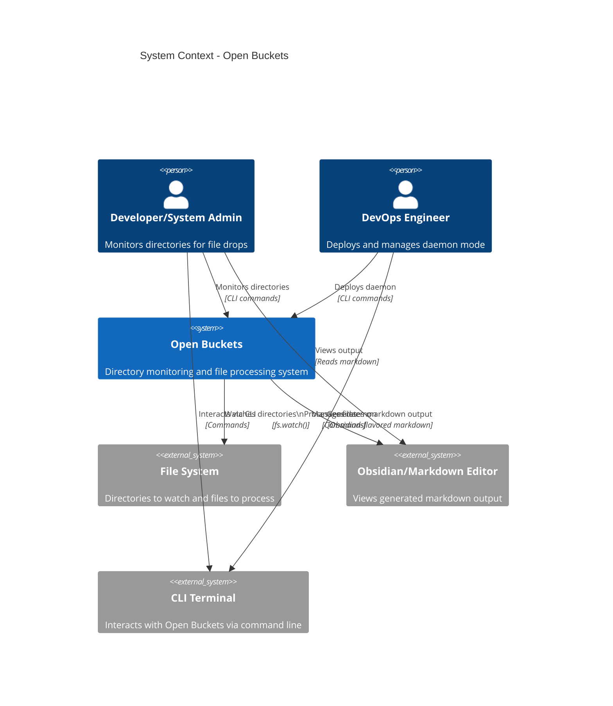

# arc42-03: System Context

## 3.1 Business Context

### 3.1.1 Problem Statement

Users need to monitor multiple directories for file drops and automatically process files based on configurable rules. Use cases include:

- **Debugging:** Monitor file-based workflows during development
- **Log Monitoring:** Watch log directories for error logs
- **QA Testing:** Verify file upload workflows
- **Data Pipelines:** Trigger automated processing on file arrival

### 3.1.2 Solution

Open Buckets provides a configurable, event-driven directory monitoring system that:
- Watches multiple directories simultaneously
- Detects file drops in real-time
- Filters files based on patterns and content
- Generates structured output (Obsidian markdown)
- Runs as a background daemon

---

## 3.2 Technical Context

### 3.2.1 C4 Level 1: System Context Diagram



### 3.2.2 System Scope and Boundaries

**Included in Open Buckets:**
- Directory watching logic
- File drop detection
- Pattern-based filtering
- Context building and directory grep
- Markdown output generation
- Daemon mode management
- Error tracking

**Excluded from Open Buckets:**
- File content transformation (beyond detection)
- Remote file system monitoring
- Real-time synchronization
- Web UI (planned for future)
- Notification systems (planned for future)

---

## 3.3 Business Processes

### 3.3.1 Primary Use Cases

#### UC-1: Monitor Single Directory

**Actor:** Developer
**Goal:** Watch a single directory for file drops
**Preconditions:** Directory exists
**Steps:**
1. User runs CLI: `open-buckets --watch ./incoming`
2. Open Buckets starts watching the directory
3. User drops a file into `./incoming`
4. Open Buckets detects the file drop
5. Open Buckets processes the file (filters, builds context)
6. Open Buckets displays the file contents (or generates markdown)
**Postconditions:** File processed successfully

#### UC-2: Monitor Multiple Directories

**Actor:** Developer
**Goal:** Watch multiple directories simultaneously
**Preconditions:** Directories exist
**Steps:**
1. User runs CLI: `open-buckets --watch ./incoming --watch ./processed`
2. Open Buckets starts watching all directories
3. User drops files into any directory
4. Open Buckets identifies source directory
5. Open Buckets processes files according to directory-specific rules
**Postconditions:** All files processed successfully

#### UC-3: Run as Daemon

**Actor:** DevOps Engineer
**Goal:** Run Open Buckets in background as a daemon
**Preconditions:** Node.js installed
**Steps:**
1. User runs CLI: `open-buckets --daemon --watch ./uploads`
2. Open Buckets forks and detaches from terminal
3. Open Buckets writes PID to `open-buckets.pid`
4. Open Buckets runs in background, monitoring directories
5. User can stop daemon: `kill $(cat open-buckets.pid)`
**Postconditions:** Daemon running in background

#### UC-4: Context Building with Patterns

**Actor:** Developer
**Goal:** Process files based on Gitignore-style patterns
**Preconditions:** `.bucket-include` file configured
**Steps:**
1. User creates `.bucket-include` with patterns:
   ```toml
   [include]
   patterns = ["*.js", "*.json"]

   [exclude]
   patterns = ["*.min.js", "node_modules/*"]
   ```
2. User runs Open Buckets with configured directory
3. User drops files into directory
4. Open Buckets filters files based on patterns
5. Open Buckets processes only matching files
**Postconditions:** Only matching files processed

#### UC-5: Directory Grep

**Actor:** Developer
**Goal:** Select files based on content matching
**Preconditions:** `.bucket-include` with `[dirs:path]` sections
**Steps:**
1. User creates `.bucket-include` with directory grep:
   ```toml
   [[dirs.include]]
   path = "./src"
   content_match = "TODO|FIXME"

   [[dirs.include]]
   path = "./docs"
   content_match = "API|REST"
   ```
2. User runs Open Buckets
3. Open Buckets searches file contents
4. Open Buckets processes only files with matching content
**Postconditions:** Content-matched files processed

---

## 3.4 User Personas

### 3.4.1 Primary Personas

#### Persona: The Debugging Developer
- **Role:** Software Developer
- **Goals:** Debug file-based workflows, monitor log directories
- **Pain Points:** Manual file checking, missing important files
- **Needs:** Real-time monitoring, pattern filtering, quick inspection
- **Skill Level:** High (comfortable with CLI and gitignore patterns)

#### Persona: The DevOps Engineer
- **Role:** System Administrator/DevOps
- **Goals:** Background monitoring, daemon management, log aggregation
- **Pain Points:** Managing multiple monitoring tools, daemon lifecycle
- **Needs:** Reliable daemon mode, PID management, error tracking
- **Skill Level:** High (comfortable with POSIX daemons)

#### Persona: The QA Tester
- **Role:** QA Engineer
- **Goals:** Test file upload workflows, verify file processing
- **Pain Points:** Manual verification, hard to reproduce issues
- **Needs:** Quick feedback, clear error messages, test automation
- **Skill Level:** Medium (comfortable with basic CLI)

---

## 3.5 External Systems

### 3.5.1 File System

**Role:** Provides directories and files to monitor
**Interface:** `fs.watch()` API (Node.js file system module)
**Responsibilities:**
- Emit file system events (creation, modification, deletion)
- Provide file content for reading
- Store configuration files (`.bucket-include`)

**Constraints:**
- Platform-specific event behavior
- Event latency varies by platform
- Network file systems may have limitations

### 3.5.2 Text Editor / Obsidian

**Role:** Displays generated markdown output
**Interface:** Reads markdown files from file system
**Responsibilities:**
- Render markdown (with wikilinks, callouts)
- Navigate between linked files
- Display frontmatter and metadata

**Features Used:**
- Obsidian Flavored Markdown
- Wikilinks: `[[Link]]`
- Callouts: `> [!info]`
- Frontmatter: YAML metadata

### 3.5.3 CLI Terminal

**Role:** User interface for interaction
**Interface:** Standard input/output
**Responsibilities:**
- Display CLI arguments and help
- Show processing status and errors
- Accept user input (commands, configuration)

---

## 3.6 Data Flow Overview

### 3.6.1 High-Level Data Flow

```
User → CLI → Open Buckets → File System
                ↓
          Pattern Matching
                ↓
          Context Building
                ↓
          Directory Grep (optional)
                ↓
          Markdown Generation
                ↓
          File System → Text Editor → User
```

### 3.6.2 Key Data Types

| Data Type | Description | Format |
|-----------|-------------|--------|
| **File Event** | File drop in monitored directory | `{ filePath, watchDir, eventType }` |
| **Configuration** | Bucket include rules | TOML (`.bucket-include`) |
| **Pattern** | File matching pattern | Gitignore-style (glob) |
| **Content Match** | Directory grep query | Regular expression |
| **Markdown** | Output format | Obsidian Flavored Markdown |
| **Error** | Failed operation | `.error` file |

---

## 3.7 Quality Requirements

### 3.7.1 Performance Requirements

| Requirement | Target | Rationale |
|-------------|--------|-----------|
| **Detection Latency** | < 1 second | Real-time monitoring |
| **Processing Time** | < 500ms (files < 1MB) | Responsiveness |
| **Concurrent Directories** | 10+ (target 50+) | Scalability |

### 3.7.2 Reliability Requirements

| Requirement | Target | Rationale |
|-------------|--------|-----------|
| **Uptime (Daemon)** | 99.9% | Production readiness |
| **Error Handling** | Graceful (no crashes) | Stability |
| **File Event Loss** | 0% | Complete coverage |

### 3.7.3 Usability Requirements

| Requirement | Target | Rationale |
|-------------|--------|-----------|
| **CLI Response Time** | < 100ms | Perceived performance |
| **Error Messages** | Clear and actionable | User experience |
| **Documentation** | Complete and up-to-date | Maintainability |

---

**Previous:** [arc42-02: Architecture Constraints](./arc42-02-architecture-constraints.md)
**Next:** [arc42-04: Building Block View](./arc42-04-building-block-view.md)
