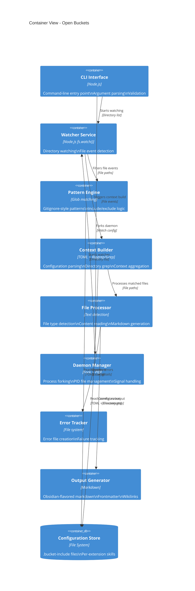

# arc42-04: Building Block View

## 4.1 Overview

This section describes the static decomposition of Open Buckets into containers and their relationships. The system follows a modular architecture with clear separation of concerns.

---

## 4.2 C4 Level 2: Container Diagram

### 4.2.1 Container View



### 4.2.2 Container Descriptions

| Container | Technology | Responsibility | Key Features |
|-----------|------------|----------------|--------------|
| **CLI Interface** | Node.js | Command-line entry point | Argument parsing, validation, help display |
| **Watcher Service** | `fs.watch()` | Directory watching | Multi-directory monitoring, event filtering |
| **Pattern Engine** | Glob patterns | Gitignore-style filtering | Include/exclude logic, pattern validation |
| **Context Builder** | TOML + Ripgrep | Configuration and grep | Directory grep, context aggregation |
| **File Processor** | Node.js streams | File processing | Type detection, content reading |
| **Daemon Manager** | Fork + PID | Background execution | Process forking, signal handling |
| **Error Tracker** | File system | Error persistence | `.error` file creation |
| **Output Generator** | Markdown | Markdown formatting | Obsidian syntax, frontmatter, wikilinks |
| **Configuration Store** | File system | Configuration storage | `.bucket-include` files, per-extension skills |

---

## 4.3 Container Details

### 4.3.1 CLI Interface

**Responsibilities:**
- Parse command-line arguments (`--watch`, `--daemon`)
- Validate directory paths
- Display usage information
- Coordinate between containers

**Public API:**
```javascript
parseArgs(args) → { watchDirs, daemon }
validateWatchDirs(dirs) → { missing, existing }
```

**Error Handling:**
- Invalid arguments → Usage message + exit code 1
- Missing directories → Error message + exit code 1
- Non-directory paths → Error message + exit code 1

**Dependencies:**
- Watcher Service
- Daemon Manager

---

### 4.3.2 Watcher Service

**Responsibilities:**
- Monitor multiple directories simultaneously
- Detect file drop events
- Identify source directory for each event
- Debounce events (100ms delay for file writes)

**Public API:**
```javascript
start(directories) → void
stop() → void
```

**Event Flow:**
```
fs.watch() → eventType="rename" → filename → 100ms delay → file exists? → processor.processFile()
```

**Error Handling:**
- Watcher errors → Log and continue
- Stat errors → Log error for specific file
- Missing files → Skip silently

**Dependencies:**
- Pattern Engine (for filtering)
- Context Builder (for context building)
- File Processor (for processing)

---

### 4.3.3 Pattern Engine

**Responsibilities:**
- Parse Gitignore-style patterns
- Implement include/exclude logic
- Handle `!` prefix for exclusions
- Support glob patterns (`*`, `**`, `?`)

**Public API:**
```javascript
matchPattern(filePath, patterns) → boolean
filterFiles(filePaths, patterns) → filteredPaths
```

**Pattern Syntax:**
- Include: `*.js`, `**/*.json`, `src/**/*.ts`
- Exclude: `!*.min.js`, `!node_modules/**`
- Directory: `logs/`, `config/`

**Error Handling:**
- Invalid patterns → Log warning, skip pattern
- Missing config → Use empty patterns (match all)

**Dependencies:**
- Configuration Store

---

### 4.3.4 Context Builder

**Responsibilities:**
- Parse `.bucket-include` TOML configuration
- Implement directory grep (content-based matching)
- Aggregate context from multiple sources
- Apply file-type skills (`.ext.bucket-include`)

**Configuration Format (TOML):**
```toml
[include]
patterns = ["*.js", "*.json"]

[exclude]
patterns = ["*.min.js", "node_modules/*"]

[[dirs.include]]
path = "./src"
content_match = "TODO|FIXME"

[[dirs.exclude]]
path = "./tests"
content_match = "skip|ignore"
```

**File-Type Skills (`.js.bucket-include`):**
```toml
[include]
patterns = ["*.js"]

[exclude]
patterns = ["*.test.js", "*.spec.js"]
```

**Public API:**
```javascript
buildContext(directory) → { files, metadata, errors }
loadConfig(directory) → configuration
grepDirectory(path, pattern) → matchedFiles
```

**Error Handling:**
- Invalid TOML → Create `.error` file with details
- Ripgrep not found → Fallback to `grep`
- Permission denied → Log error, skip directory

**Dependencies:**
- Configuration Store
- Pattern Engine

---

### 4.3.5 File Processor

**Responsibilities:**
- Detect file type (text vs binary)
- Read file contents
- Determine encoding
- Handle binary files gracefully

**Text File Detection Heuristics:**
- Check first 8KB for null bytes
- Detect common binary signatures (PDF, ZIP, PNG, JPEG, ELF)
- Attempt UTF-8 decode as fallback

**Public API:**
```javascript
processFile(filePath, watchDir) → void
isTextFile(filePath) → boolean
formatFileSize(bytes) → string
```

**Output Format:**
```
================================================================================
File dropped: test.txt
Watch directory: /path/to/incoming
Full path: /path/to/incoming/test.txt
Size: 45 B
Detected at: 2026-02-18T04:23:45.123Z

Content (text file):
----------------------------------------
Hello, World! This is a test file.
----------------------------------------
[END OF FILE]
================================================================================
```

**Error Handling:**
- Read errors → Log error, continue
- Permission denied → Log error, skip
- Binary files → Skip with message

**Dependencies:**
- Output Generator
- Error Tracker

---

### 4.3.6 Daemon Manager

**Responsibilities:**
- Fork process for background execution
- Manage PID file (`open-buckets.pid`)
- Handle signals (SIGTERM, SIGINT)
- Check daemon status

**Public API:**
```javascript
start(callback) → void
stop() → void
status() → void
isRunning() → boolean
```

**PID File Location:**
- Default: `./open-buckets.pid` (current working directory)
- Future: Configurable path

**Signal Handling:**
- `SIGTERM` → Graceful shutdown, remove PID file
- `SIGINT` → Graceful shutdown, remove PID file

**Error Handling:**
- Already running → Error message, exit code 1
- Fork failure → Error message, exit code 1
- Stale PID file → Auto-clean, proceed

**Dependencies:**
- Watcher Service

---

### 4.3.7 Error Tracker

**Responsibilities:**
- Create `.error` files for failed operations
- Persist error details
- Track failure patterns

**Error File Format:**
```json
{
  "timestamp": "2026-02-18T04:23:45.123Z",
  "error": "Invalid TOML configuration",
  "file": "/path/to/.bucket-include",
  "details": "Expected string at line 5, column 3"
}
```

**Error Types:**
- Configuration errors (invalid TOML)
- File system errors (permission denied, file not found)
- Processing errors (invalid encoding, corrupt file)

**Public API:**
```javascript
trackError(error, context) → void
getErrorFiles(directory) → errorPaths
```

---

### 4.3.8 Output Generator

**Responsibilities:**
- Generate Obsidian Flavored Markdown
- Add frontmatter (YAML metadata)
- Create wikilinks for cross-references
- Format callouts and other Obsidian features

**Markdown Format:**
```markdown
---
tags: [file-drop, context-build]
source: /path/to/file.txt
watchDir: /path/to/incoming
---

# File: test.txt

> [!info]
> This file was dropped at 2026-02-18T04:23:45.123Z

## Content

Hello, World! This is a test file.

## Context

- [[Related File]]
- [[Another Context]]
```

**Public API:**
```javascript
generateMarkdown(file, metadata, context) → markdownString
addFrontmatter(markdown, metadata) → markdownWithFrontmatter
addWikilinks(markdown, links) → markdownWithLinks
```

**Features:**
- Wikilinks: `[[Link]]`
- Callouts: `> [!info]`, `> [!warning]`, `> [!error]`
- Frontmatter: YAML metadata block
- Embeds: `![[Embedded File]]`

**Dependencies:**
- None (pure formatting)

---

### 4.3.9 Configuration Store

**Responsibilities:**
- Store `.bucket-include` configuration files
- Support file-type skills (`.ext.bucket-include`)
- Provide per-directory configuration

**Configuration File Locations:**
- Directory-level: `.bucket-include` (applies to directory and subdirectories)
- File-type: `.js.bucket-include`, `.json.bucket-include` (applies to specific extensions)
- Global: `~/.open-buckets/config.toml` (future)

**File Lookup Order:**
1. `.bucket-include` in current directory
2. `.bucket-include` in parent directory (recursive)
3. `.ext.bucket-include` for file extension
4. Global configuration (future)

**Public API:**
```javascript
loadConfig(directory) → configuration
loadFileSkill(extension) → skillConfig
findConfigFiles(directory) → configPaths
```

**Error Handling:**
- Missing config → Return empty config
- Invalid config → Create `.error` file, return empty config

---

## 4.4 Container Interaction Patterns

### 4.4.1 File Drop Processing Flow

```
CLI Interface
  ↓
Watcher Service (fs.watch)
  ↓ (file event)
Pattern Engine (filter by patterns)
  ↓ (matched)
Context Builder (build context)
  ↓ (files to process)
File Processor (read and detect type)
  ↓ (contents)
Output Generator (markdown)
  ↓
File System (write markdown)
  ↓ (error on failure)
Error Tracker (create .error file)
```

### 4.4.2 Daemon Startup Flow

```
CLI Interface (parse --daemon)
  ↓
Daemon Manager (fork process)
  ↓
Daemon Process (write PID)
  ↓
Watcher Service (start watching)
  ↓
Event Loop (wait for file drops)
```

---

## 4.5 Quality Attributes by Container

| Container | Performance | Reliability | Extensibility | Security |
|-----------|-------------|-------------|---------------|----------|
| **CLI Interface** | Fast parsing | Validates input | Easy to add commands | Validates paths |
| **Watcher Service** | Real-time events | Handles errors | Pluggable filters | Follows symlinks (no) |
| **Pattern Engine** | Fast glob matching | Handles invalid patterns | Extensible syntax | Safe patterns |
| **Context Builder** | Efficient grep | Graceful fallbacks | Configurable skills | Safe TOML parsing |
| **File Processor** | Streaming reads | Handles errors | New detectors | No code exec |
| **Daemon Manager** | Fast forking | Handles signals | Configurable PID | Safe forking |
| **Error Tracker** | Async writes | Never crashes | Custom formats | No exfiltration |
| **Output Generator** | String building | Never crashes | New formats | No template injection |
| **Configuration Store** | File reads | Handles missing files | Multiple sources | No code injection |

---

**Previous:** [arc42-03: System Context](./arc42-03-system-context.md)
**Next:** [arc42-05: Runtime View](./arc42-05-runtime-view.md)
