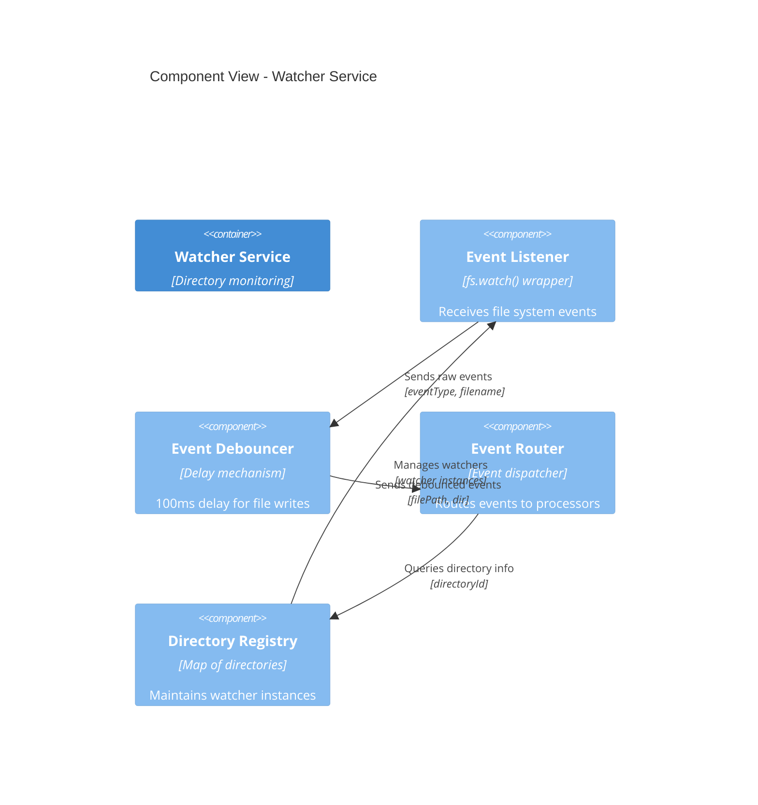
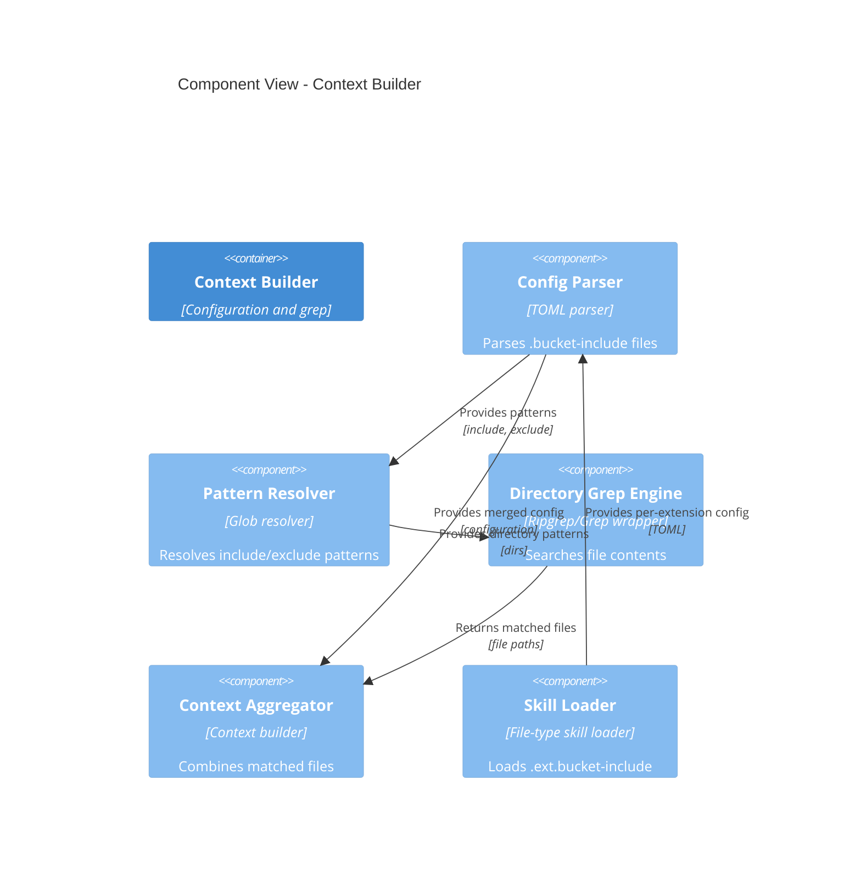
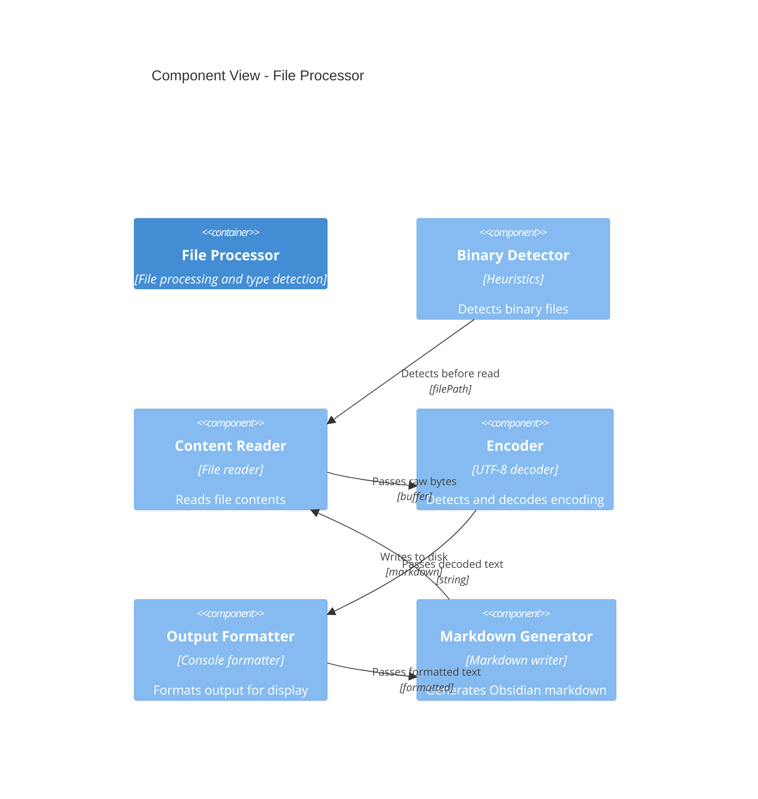
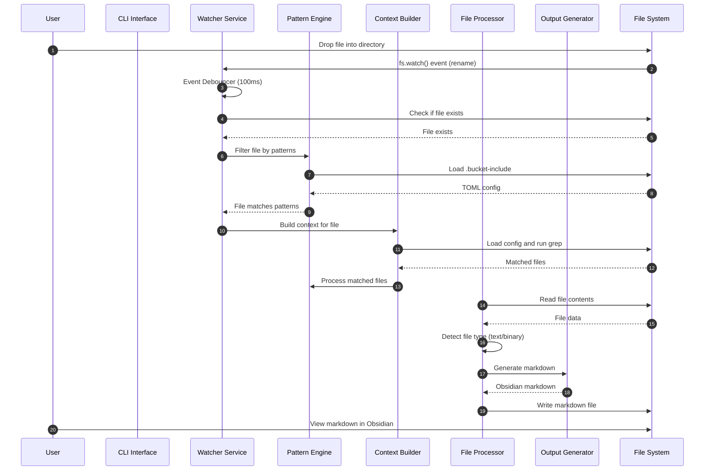
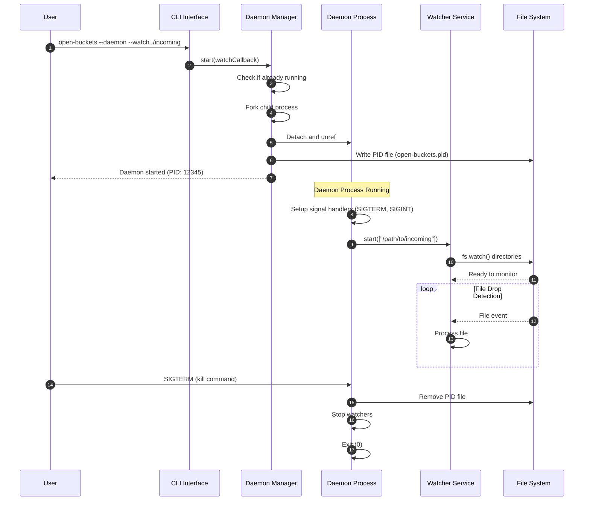
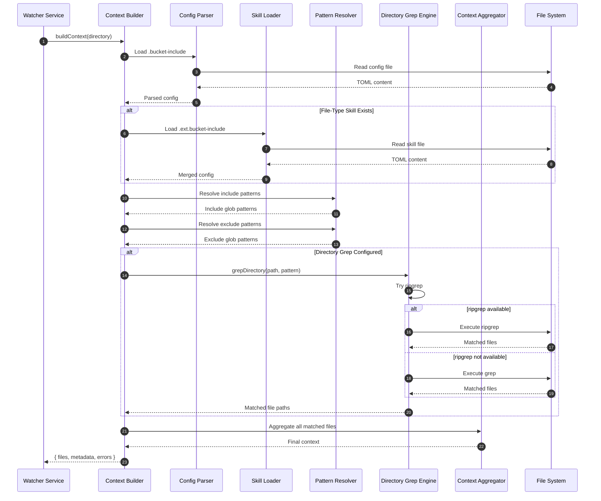
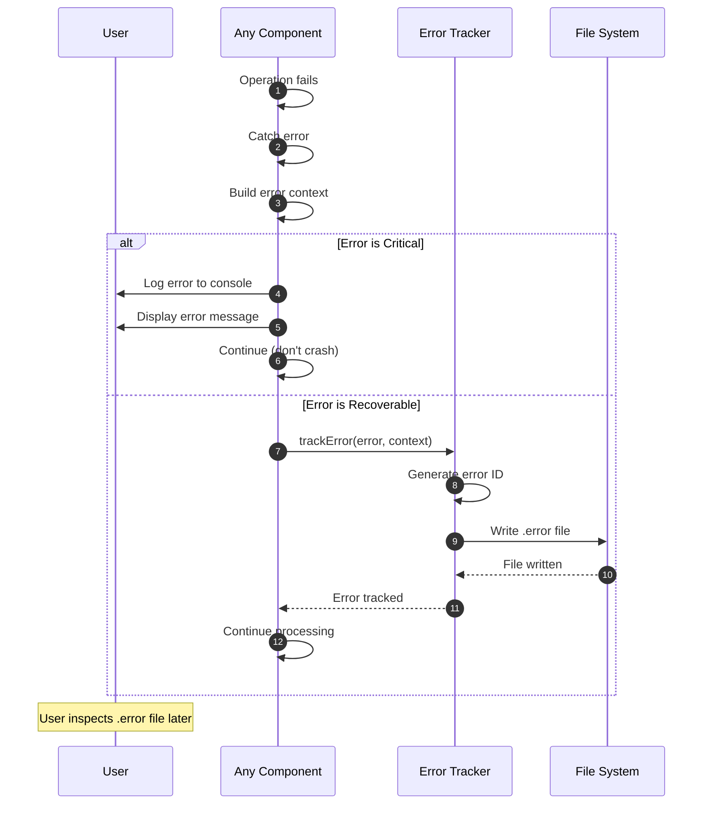

# arc42-05: Runtime View

## 5.1 Overview

This section describes the dynamic behavior and runtime aspects of Open Buckets, including:
- Component-level interactions (C4 Level 3)
- Sequence diagrams for key workflows
- Concurrency and threading model
- Event-driven architecture

---

## 5.2 C4 Level 3: Component Diagram

### 5.2.1 Component View (Watcher Service)



### 5.2.2 Component View (Context Builder)



### 5.2.3 Component View (File Processor)



---

## 5.3 Sequence Diagrams

### 5.3.1 File Drop Processing



### 5.3.2 Daemon Startup and Operation



### 5.3.3 Context Building with Directory Grep



### 5.3.4 Error Handling Flow



---

## 5.4 Concurrency Model

### 5.4.1 Threading Architecture

Open Buckets uses Node.js's **single-threaded event loop** with **asynchronous I/O**:

| Aspect | Implementation | Details |
|--------|---------------|---------|
| **Event Loop** | Node.js runtime | Single-threaded, non-blocking I/O |
| **File Watching** | `fs.watch()` callbacks | Async event emission |
| **File Reading** | `fs.readFile()` | Async streaming |
| **Pattern Matching** | Glob library (sync) | Fast, synchronous |
| **Directory Grep** | `exec('ripgrep')` | Spawned subprocess, async |
| **Daemon** | `child_process.fork()` | Separate process, async |

### 5.4.2 Concurrency Patterns

#### Pattern 1: Event-Driven File Watching

```javascript
// Single event loop handles multiple directories
watcher.on('change', (event, filename) => {
  // Async processing without blocking
  setTimeout(async () => {
    await processFile(filename);
  }, 100);
});
```

**Benefits:**
- Non-blocking file system events
- Handles multiple directories efficiently
- No thread contention

**Constraints:**
- CPU-bound operations block event loop
- Pattern matching should be fast

#### Pattern 2: Subprocess for Directory Grep

```javascript
// Spawn ripgrep subprocess (non-blocking)
const { exec } = require('child_process');
exec('rg "TODO" ./src', (error, stdout, stderr) => {
  if (error) {
    // Handle error or fallback to grep
    return;
  }
  // Process matched files
});
```

**Benefits:**
- Doesn't block event loop
- Leverages ripgrep's speed
- Parallel grep possible (multiple directories)

**Constraints:**
- Must handle subprocess lifecycle
- Fallback to built-in `grep` if ripgrep not available

#### Pattern 3: Daemon Process Fork

```javascript
// Fork child process (background execution)
const child = spawn('node', process.argv.slice(1), {
  detached: true,
  stdio: ['ignore', 'ignore', 'ignore']
});
child.unref(); // Allow parent to exit
```

**Benefits:**
- True background execution
- Independent lifecycle
- POSIX-compliant daemon behavior

**Constraints:**
- No stdio in child (log to file)
- Must manage PID file manually

---

## 5.5 State Management

### 5.5.1 In-Memory State

| Component | State | Lifetime | Persistence |
|-----------|-------|----------|-------------|
| **Watcher Service** | `watchers: Map<dir, watcher>` | Process lifetime | No |
| **Context Builder** | `configs: Map<dir, config>` | Process lifetime | No |
| **Pattern Engine** | `cache: Map<pattern, regex>` | Process lifetime | No |
| **Daemon Manager** | `pid: number` (in PID file) | Daemon lifetime | Yes (file) |

### 5.5.2 Persistent State

| State | Location | Format | Purpose |
|-------|----------|--------|---------|
| **PID** | `./open-buckets.pid` | Plain text (number) | Daemon process identification |
| **Configuration** | `.bucket-include` | TOML | Directory rules and patterns |
| **Skills** | `.ext.bucket-include` | TOML | File-type specific rules |
| **Errors** | `.error` files | JSON | Failed operation tracking |
| **Output** | `.md` files | Obsidian Markdown | Generated documentation |

### 5.5.3 State Transitions

#### Daemon Lifecycle

```
NOT_RUNNING → STARTING → RUNNING → STOPPING → NOT_RUNNING
     ↑                                        ↓
     └────────────────────────────────────────┘
              (restart on crash)
```

#### File Processing State

```
FILE_DETECTED → PATTERN_MATCH → CONTEXT_BUILD → PROCESS → OUTPUT_GENERATED
      ↓               ↓               ↓           ↓           ↓
   (ignore)     (no match)     (no files)  (binary)    (error file)
```

---

## 5.6 Performance Considerations

### 5.6.1 Bottlenecks and Optimizations

| Operation | Bottleneck | Optimization |
|-----------|------------|--------------|
| **File Detection** | Platform event latency | Use chokidar (future) |
| **Pattern Matching** | Repeated glob compilation | Cache compiled regex |
| **Directory Grep** | Scanning large directories | Limit depth, use ripgrep |
| **File Reading** | Large files (>10MB) | Stream, don't load full file |
| **Markdown Generation** | String concatenation | Use template strings |
| **Daemon Forking** | Process startup time | Keep lightweight |

### 5.6.2 Scaling Considerations

| Scale | Current Limit | Target Limit | Strategy |
|-------|---------------|--------------|----------|
| **Directories** | 10+ | 50+ | Single event loop handles many |
| **Files/Second** | ~10 | ~50 | Debounce, queue processing |
| **File Size** | ~10MB | ~100MB | Streaming, partial read |
| **Context Size** | ~100 files | ~1000 files | Pagination, incremental build |

---

## 5.7 Error Handling Strategies

### 5.7.1 Error Categories

| Category | Example | Handling Strategy |
|----------|---------|-------------------|
| **Configuration** | Invalid TOML | Log error, use empty config |
| **File System** | Permission denied | Log error, skip file |
| **File Content** | Binary file detected | Skip, log message |
| **External Tool** | ripgrep not found | Fallback to `grep` |
| **Runtime** | Uncaught exception | Log, continue if possible |

### 5.7.2 Error Recovery

**Pattern: Graceful Degradation**

```javascript
try {
  // Attempt operation
  const result = await riskyOperation();
  return result;
} catch (error) {
  // Log error
  logger.error('Operation failed', error);
  // Create .error file
  errorTracker.trackError(error, context);
  // Return fallback or continue
  return fallbackValue;
}
```

**Benefits:**
- System continues running
- User can diagnose issues later
- No data loss

---

**Previous:** [arc42-04: Building Block View](./arc42-04-building-block-view.md)
**Next:** [arc42-06: Cross-Cutting Concepts](./arc42-06-cross-cutting-concepts.md)
