# Open Buckets - Architectural Diagrams

This document contains all architectural diagrams for the Open Buckets system using the C4 Model.

---

## C4 Level 1: System Context

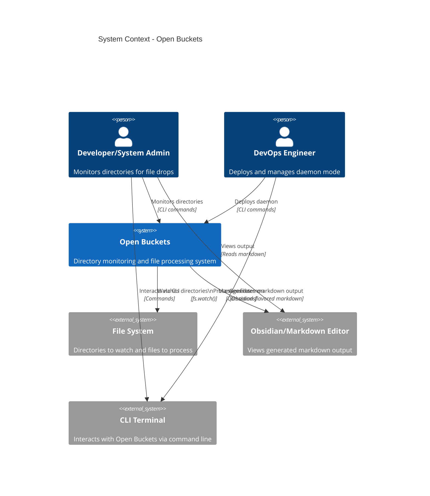

---

## C4 Level 2: Container View

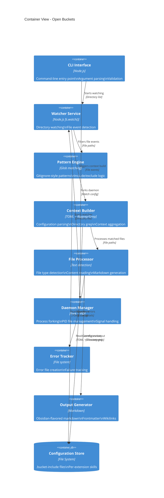

---

## C4 Level 3: Component - Watcher Service

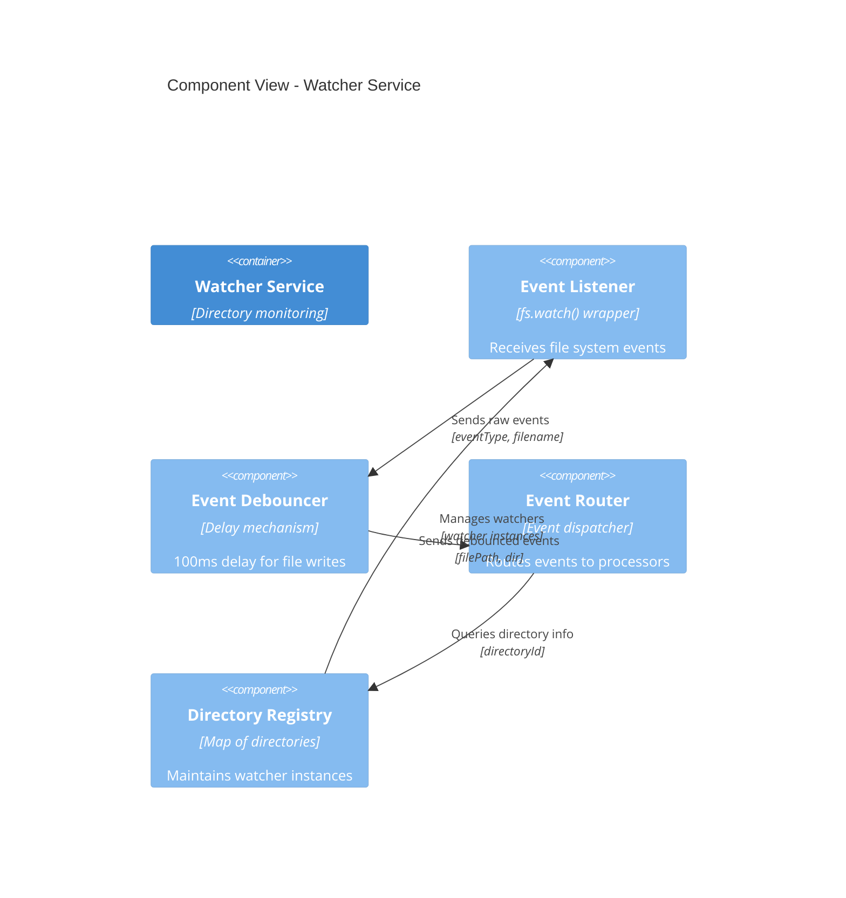

---

## C4 Level 3: Component - Context Builder

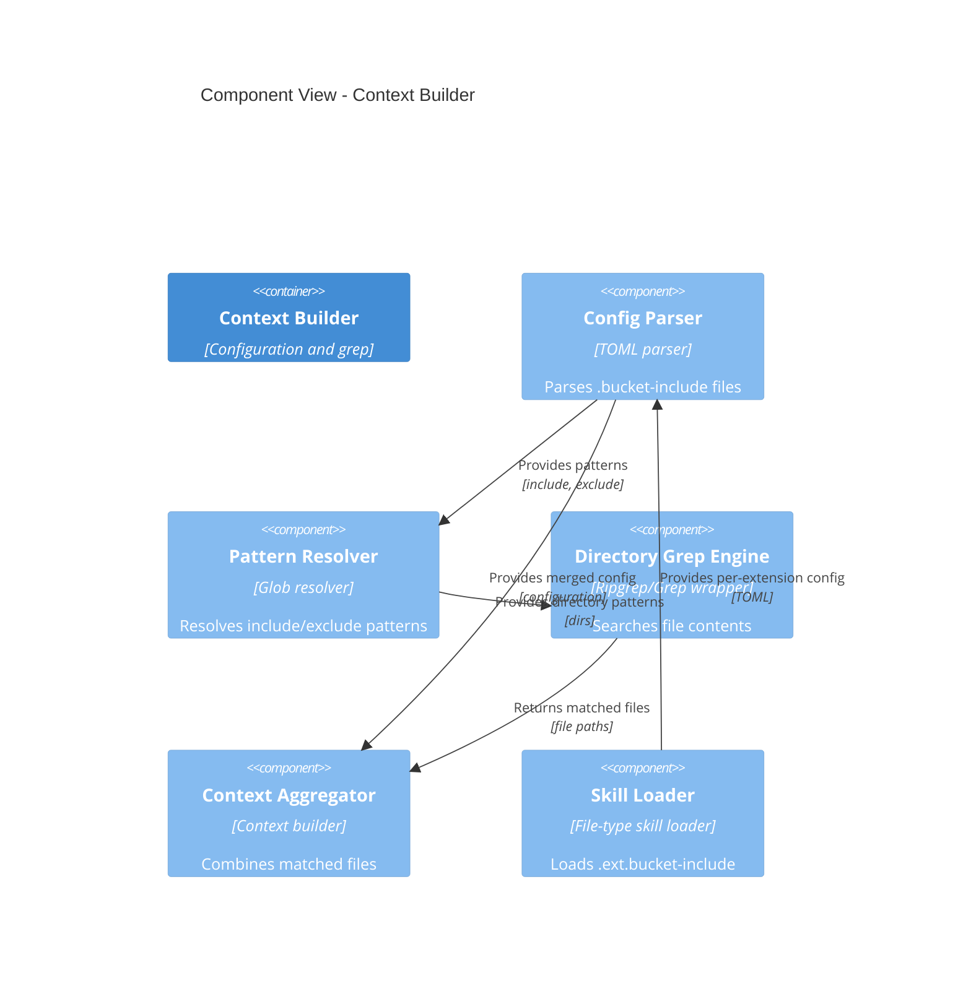

---

## C4 Level 3: Component - File Processor

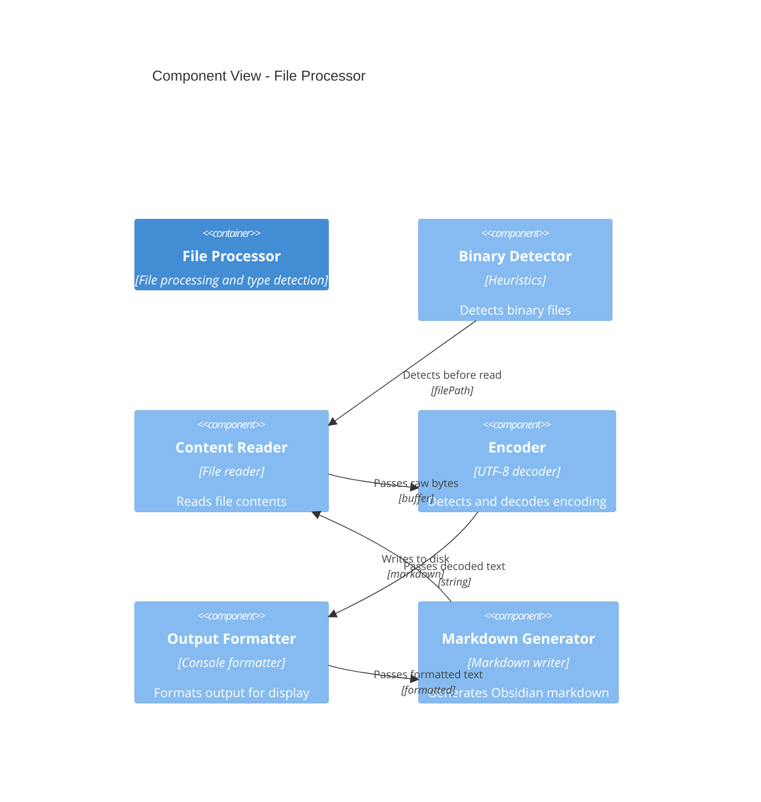

---

## Sequence Diagram: File Drop Processing

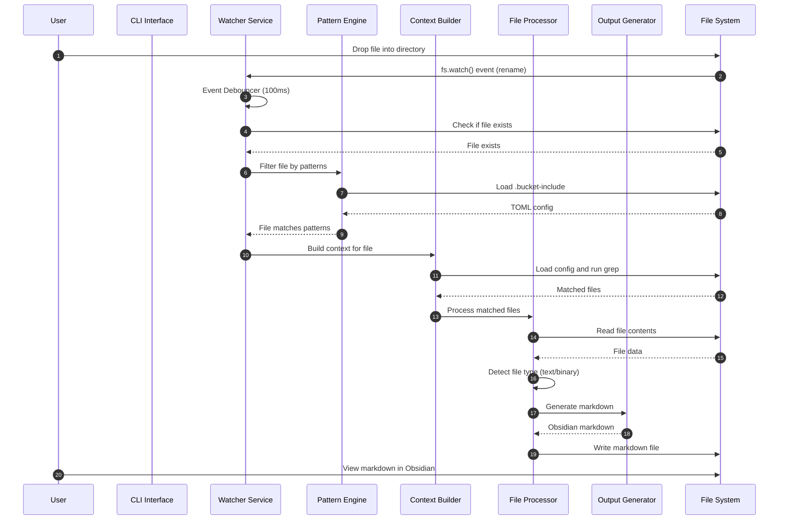

---

## Sequence Diagram: Daemon Startup

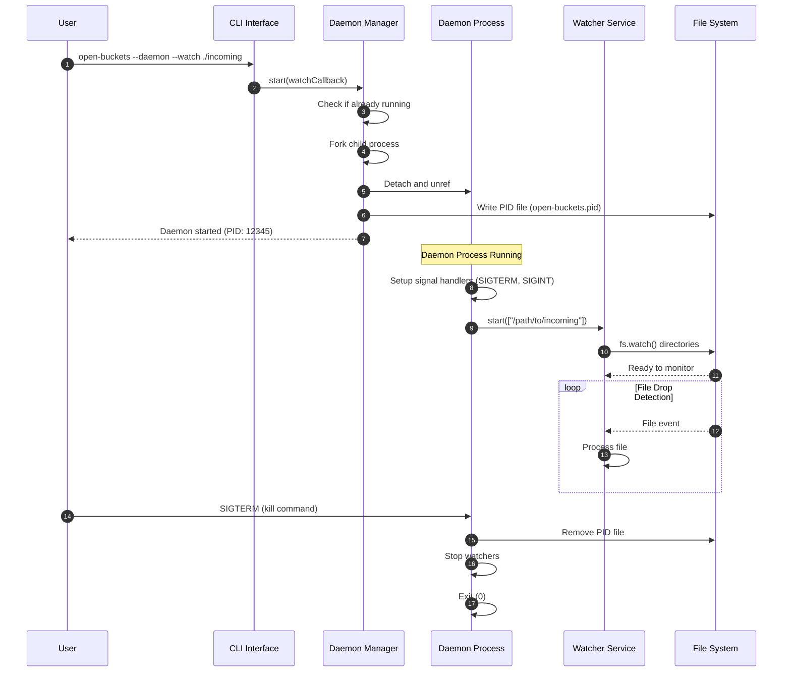

---

## Sequence Diagram: Context Building

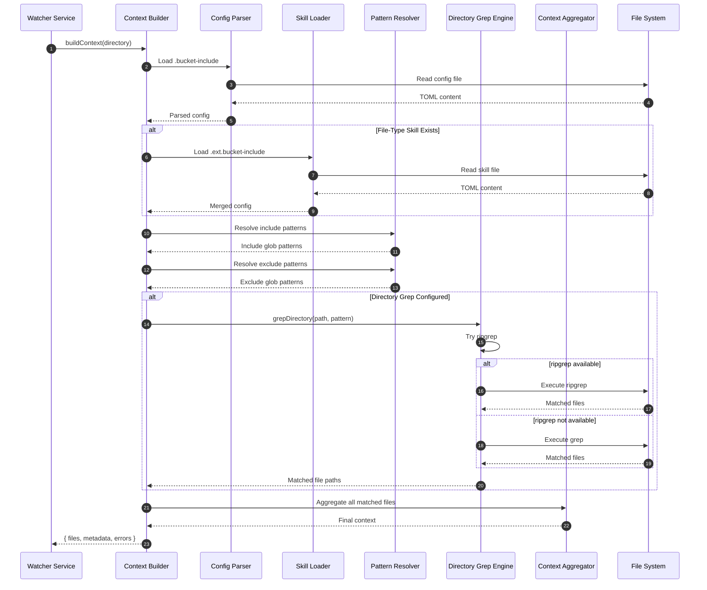

---

## State Diagram: Daemon Lifecycle

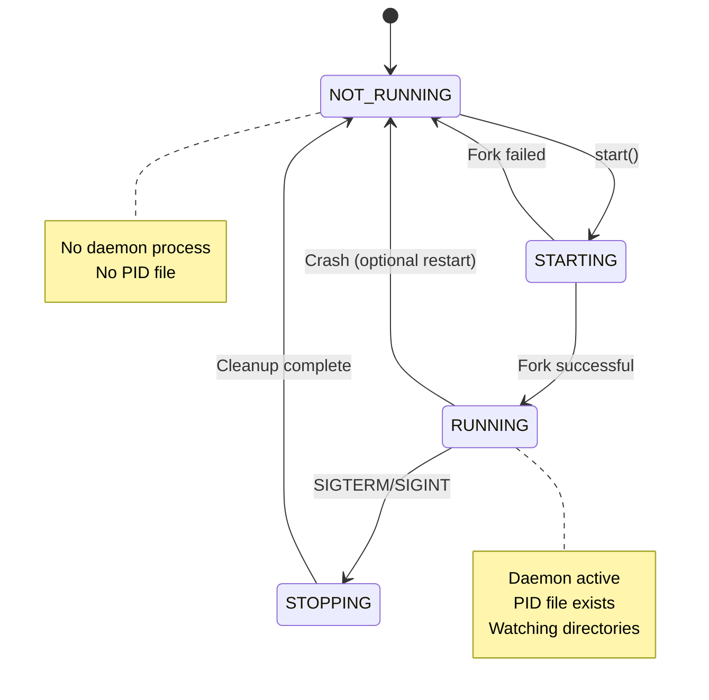

---

## State Diagram: File Processing

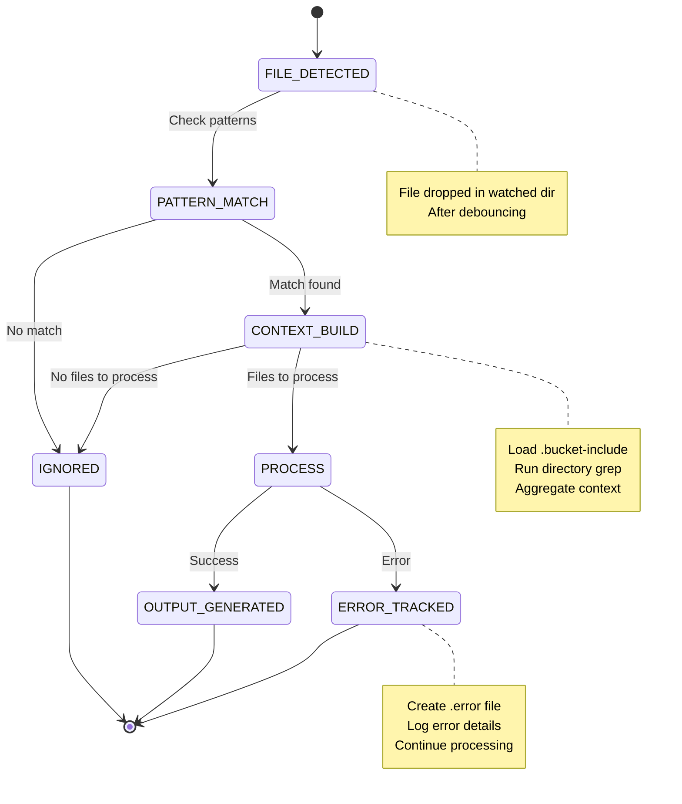

---

## Data Flow: Processing Pipeline

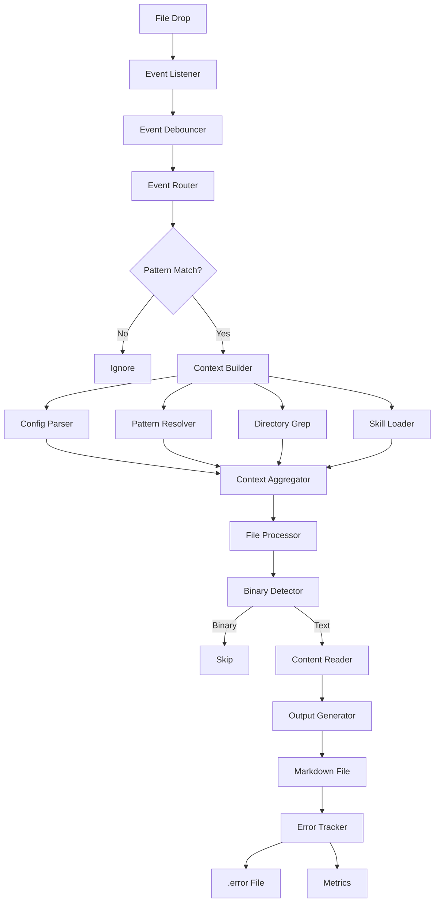

---

## Deployment Diagram

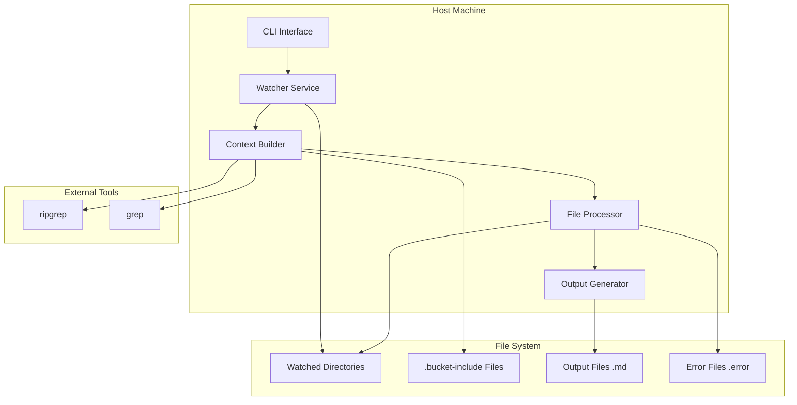

---

## Legend

### C4 Model Levels

- **Level 1: System Context** - Big picture view of the system in its environment
- **Level 2: Containers** - High-level technology building blocks
- **Level 3: Components** - Logical groupings within containers

### Notation

- **Person** - User or stakeholder
- **System** - Software system being documented
- **Container** - Deployable unit (service, database, app)
- **Component** - Logical grouping of functionality
- **Rel(Relationship)** - Communication between elements

---

## How to View These Diagrams

1. **Mermaid Live Editor:** https://mermaid.live
2. **GitHub/GitLab:** Native Mermaid rendering in markdown
3. **VS Code:** Install Mermaid Preview extension
4. **Obsidian:** Install Mermaid plugin
5. **Command Line:** `mmdc` (Mermaid CLI)

---

**References:**
- [C4 Model](https://c4model.com)
- [Mermaid Documentation](https://mermaid.js.org)
- [arc42 Template](https://arc42.org)
