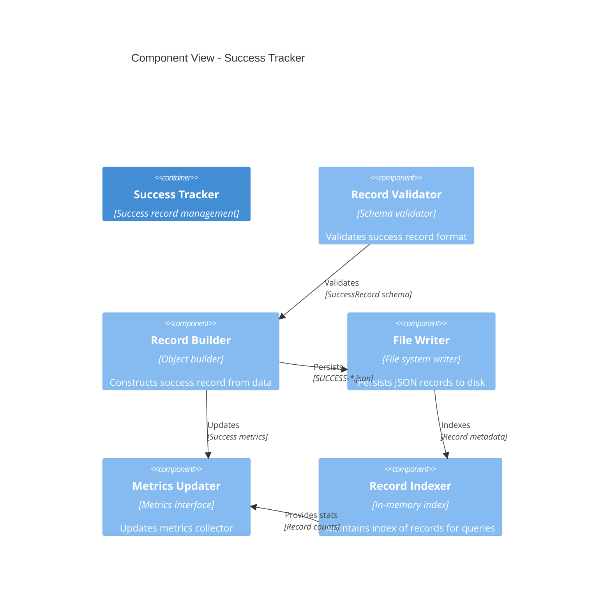
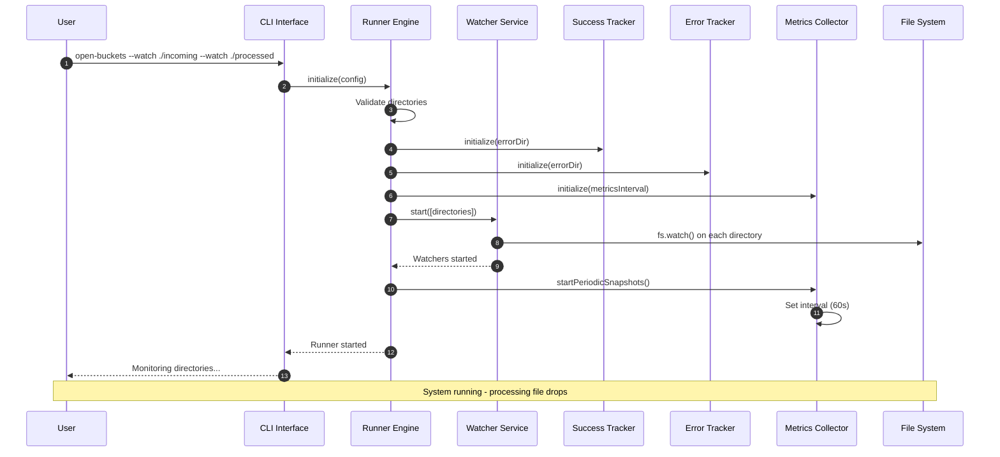
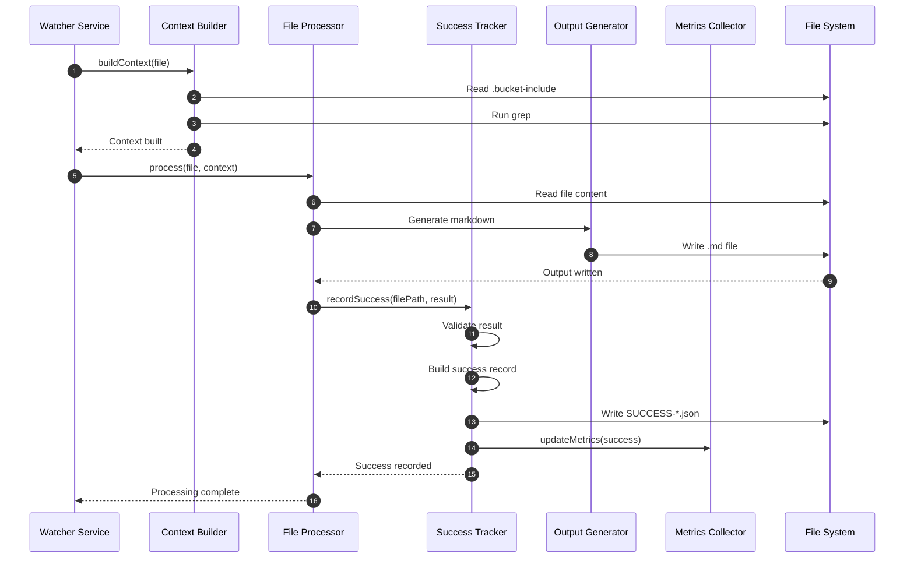
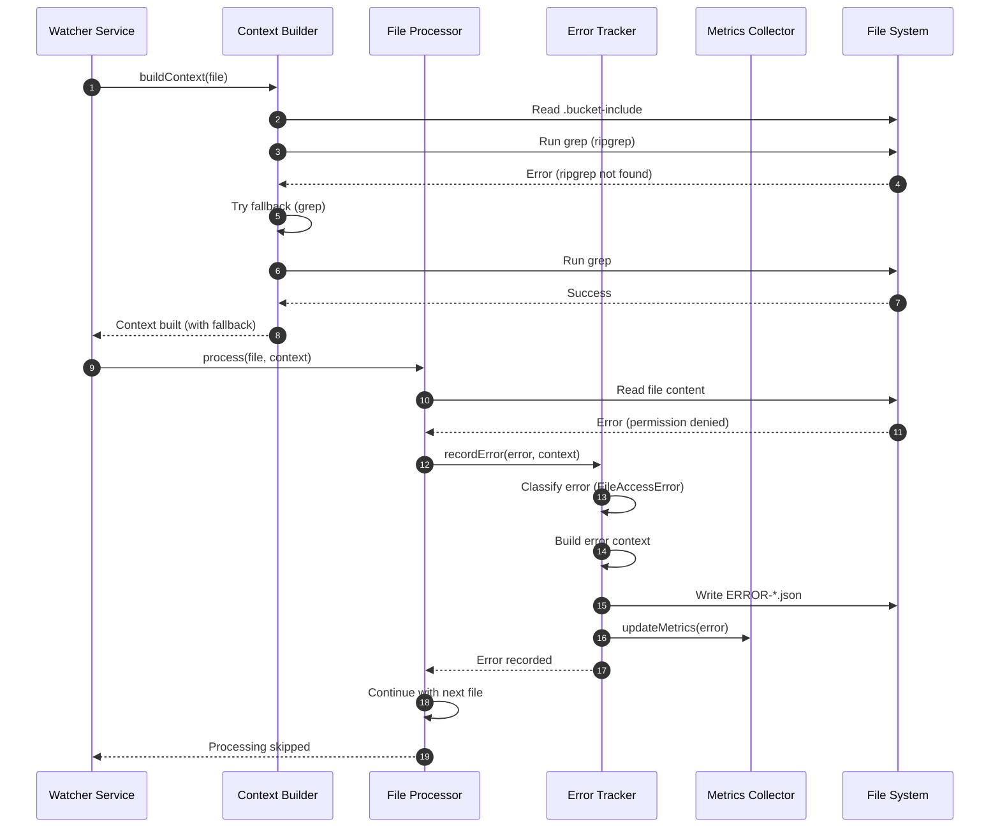
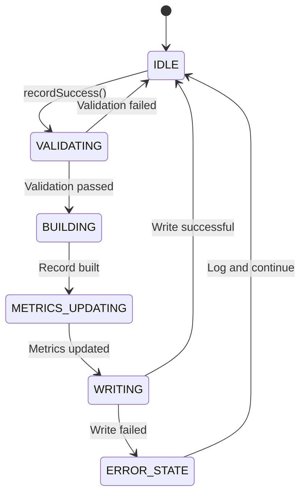
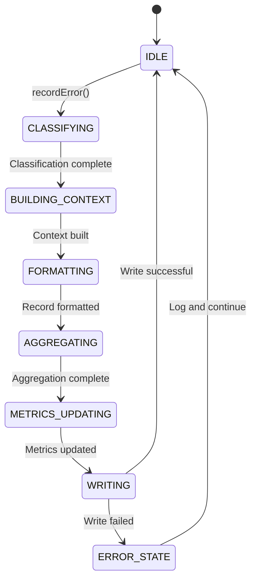

# Open Buckets - Architectural Diagrams

This document contains all architectural diagrams for the Open Buckets system using the C4 Model.

---

## C4 Level 1: System Context


---

## C4 Level 2: Container View


---

## C4 Level 3: Component - Watcher Service


---

## C4 Level 3: Component - Context Builder


---

## C4 Level 3: Component - File Processor


---

## C4 Level 3: Component - Success Tracker



---

## C4 Level 3: Component - Error Tracker

```mermaid
C4Component
  title Component View - Error Tracker

  Container(error_tracker, "Error Tracker", "Error record management")

  Component(error_classifier, "Error Classifier", "Categorization engine", "Categorizes errors by type")
  Component(error_context, "Error Context Builder", "Context extractor", "Extracts operation context")
  Component(error_formatter, "Error Formatter", "Structured formatter", "Formats error details")
  Component(error_writer, "Error Writer", "File system writer", "Persists JSON records to disk")
  Component(error_aggregator, "Error Aggregator", "Statistics engine", "Aggregates error statistics")
  Component(recovery_logger, "Recovery Logger", "Recovery tracker", "Logs recovery attempts")

  Rel(error_classifier, error_context, "Classifies", "Error category")
  Rel(error_context, error_formatter, "Provides context", "Operation details")
  Rel(error_formatter, error_writer, "Persists", "ERROR-*.json")
  Rel(error_formatter, error_aggregator, "Aggregates", "Error statistics")
  Rel(error_classifier, recovery_logger, "Tracks", "Recovery attempts")
  Rel(error_aggregator, metrics_updater, "Updates", "Error metrics")
```

---

## C4 Level 3: Component - Metrics Collector

```mermaid
C4Component
  title Component View - Metrics Collector

  Container(metrics_collector, "Metrics Collector", "Metrics aggregation")

  Component(counter_aggregator, "Counter Aggregator", "Sum counter", "Accumulates count metrics")
  Component(gauge_sampler, "Gauge Sampler", "Value sampler", "Samples gauge metrics")
  Component(histogram_collector, "Histogram Collector", "Distribution collector", "Collects histogram data")
  Component(rate_calculator, "Rate Calculator", "Rate engine", "Calculates rates (per second)")
  Component(percentile_calculator, "Percentile Calculator", "Percentile engine", "Calculates P50, P90, P95, P99")
  Component(snapshot_generator, "Snapshot Generator", "Snapshot engine", "Generates periodic snapshots")
  Component(alert_checker, "Alert Checker", "Threshold monitor", "Monitors metrics against thresholds")

  Rel(counter_aggregator, snapshot_generator, "Provides", "Counter totals")
  Rel(gauge_sampler, snapshot_generator, "Provides", "Gauge values")
  Rel(histogram_collector, percentile_calculator, "Provides", "Distribution data")
  Rel(rate_calculator, snapshot_generator, "Provides", "Rate metrics")
  Rel(percentile_calculator, snapshot_generator, "Provides", "Percentile values")
  Rel(snapshot_generator, alert_checker, "Monitors", "Metric thresholds")
  Rel(alert_checker, metrics_updater, "Triggers", "Alert notifications")
```

---

## Sequence Diagram: File Drop Processing


---

## Sequence Diagram: Daemon Startup


---

## Sequence Diagram: Context Building


---

## State Diagram: Daemon Lifecycle


---

## State Diagram: File Processing


---

## Sequence Diagram: Runner Startup



---

## Sequence Diagram: Success Processing with Tracking



---

## Sequence Diagram: Error Processing with Tracking



---

## State Diagram: Success Tracker Lifecycle



---

## State Diagram: Error Tracker Lifecycle



---

## Data Flow: Processing Pipeline


---

## Deployment Diagram


---

## Complete Runner Data Flow

```mermaid
flowchart TD
    subgraph "Input"
        A[File Drop]
        B[.bucket-include Config]
    end

    subgraph "Watcher Service"
        C[Event Listener]
        D[Event Debouncer]
        E[Event Router]
    end

    subgraph "Context Builder"
        F[Config Parser]
        G[Pattern Resolver]
        H[Directory Grep Engine]
    end

    subgraph "File Processor"
        I[Binary Detector]
        J[Content Reader]
        K[Output Generator]
    end

    subgraph "Tracking System"
        L[Success Tracker]
        M[Error Tracker]
        N[Metrics Collector]
    end

    subgraph "Output"
        O[Markdown Files]
        P[Success Records JSON]
        Q[Error Records JSON]
        R[Metrics Snapshots]
        S[Placeholders MD]
    end

    A --> C
    C --> D
    D --> E
    B --> F
    B --> G
    F --> E
    G --> E
    E --> H
    H --> I
    I --> J
    J --> K

    K -->|Success| L
    K -->|Error| M

    L --> P
    L --> N
    M --> Q
    M --> N

    N --> R
    N --> S

    K --> O

    style L fill:#d4edda
    style M fill:#f8d7da
    style N fill:#fff3cd
    style O fill:#e1f5ff
    style P fill:#d4edda
    style Q fill:#f8d7da
    style R fill:#fff3cd
    style S fill:#e1f5ff
```

---

## Error Recovery Flow

```mermaid
flowchart TD
    A[Error Detected] --> B{Error Type?}

    B -->|Configuration| C[Use Default Config]
    B -->|FileAccess| D[Skip File]
    B -->|ExternalTool| E[Try Fallback]

    E --> F{Fallback Available?}
    F -->|Yes| G[Execute Fallback]
    F -->|No| H[Check Circuit Breaker]

    G --> I{Fallback Success?}
    I -->|Yes| J[Continue Processing]
    I -->|No| H

    H --> K{Circuit State?}
    K -->|CLOSED| L[Retry with Backoff]
    K -->|HALF OPEN| M[Test Call]
    K -->|OPEN| N[Skip & Log Error]

    L --> O{Max Retries?}
    O -->|No| E
    O -->|Yes| P[Open Circuit]

    M --> Q{Test Success?}
    Q -->|Yes| R[Close Circuit]
    Q -->|No| P

    N --> S[Record Error]
    P --> S
    C --> T[Continue with Defaults]
    D --> S

    style E fill:#fff3cd
    style G fill:#fff3cd
    style L fill:#fff3cd
    style M fill:#fff3cd
    style P fill:#f8d7da
    style N fill:#f8d7da
    style S fill:#f8d7da
```

---

## Metrics Aggregation Flow

```mermaid
flowchart LR
    subgraph "Sources"
        A[Success Tracker]
        B[Error Tracker]
        C[Watcher Service]
        D[Processor Manager]
    end

    subgraph "Metrics Collector"
        E[Counter Aggregator]
        F[Gauge Sampler]
        G[Histogram Collector]
        H[Rate Calculator]
        I[Percentile Calculator]
    end

    subgraph "Output"
        J[Console Display]
        K[Log Files JSON]
        L[METRICS_SNAPSHOT.md]
    end

    A --> E
    B --> E
    A --> F
    B --> F
    C --> F
    D --> G
    A --> G
    B --> G

    E --> H
    F --> H
    E --> I
    G --> I

    H --> J
    F --> J
    H --> K
    I --> K
    H --> L
    I --> L

    style E fill:#d1ecf1
    style F fill:#d1ecf1
    style G fill:#d1ecf1
    style H fill:#d1ecf1
    style I fill:#d1ecf1
    style L fill:#e1f5ff
```

---

## Legend

### C4 Model Levels

- **Level 1: System Context** - Big picture view of the system in its environment
- **Level 2: Containers** - High-level technology building blocks
- **Level 3: Components** - Logical groupings within containers

### Notation

- **Person** - User or stakeholder
- **System** - Software system being documented
- **Container** - Deployable unit (service, database, app)
- **Component** - Logical grouping of functionality
- **Rel(Relationship)** - Communication between elements

---

## How to View These Diagrams

1. **Mermaid Live Editor:** https://mermaid.live
2. **GitHub/GitLab:** Native Mermaid rendering in markdown
3. **VS Code:** Install Mermaid Preview extension
4. **Obsidian:** Install Mermaid plugin
5. **Command Line:** `mmdc` (Mermaid CLI)

---

**References:**
- [C4 Model](https://c4model.com)
- [Mermaid Documentation](https://mermaid.js.org)
- [arc42 Template](https://arc42.org)
