# Open Buckets Runner - Implementation and Tracking

**Version:** 1.0
**Date:** 2026-02-18
**Status:** Design Document

---

## Overview

The Open Buckets Runner is the execution engine that coordinates file watching, processing, and output generation. It provides comprehensive error and success tracking to ensure reliable operation and easy debugging.

---

## Architecture

### C4 Level 2: Container View - Runner Architecture

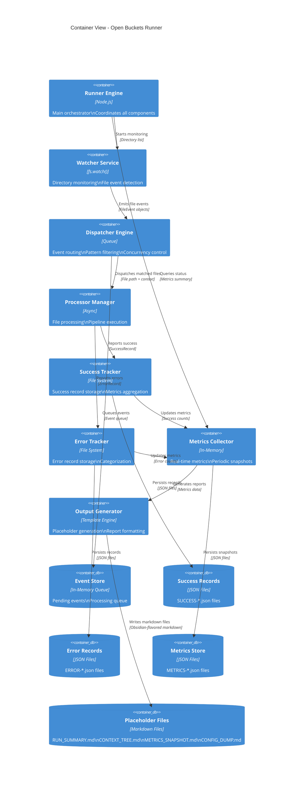

### High-Level Flow

```
┌─────────────────────────────────────────────────────────────┐
│                    Open Buckets Runner                      │
├─────────────────────────────────────────────────────────────┤
│                                                               │
│  ┌─────────────┐    ┌──────────────┐    ┌──────────────┐   │
│  │   Watcher   │───→│  Dispatcher  │───→│  Processor   │   │
│  │   Service   │    │   Engine     │    │   Manager    │   │
│  └─────────────┘    └──────────────┘    └──────────────┘   │
│        ↓                   ↓                   ↓            │
│  ┌─────────────┐    ┌──────────────┐    ┌──────────────┐   │
│  │   Event     │    │   Pattern    │    │   Context    │   │
│  │   Tracker   │    │   Engine    │    │   Builder    │   │
│  └─────────────┘    └──────────────┘    └──────────────┘   │
│                                                               │
│  ┌─────────────────────────────────────────────────────┐   │
│  │              Tracking & Reporting                   │   │
│  │  ┌──────────┐  ┌──────────┐  ┌──────────────────┐  │   │
│  │  │ Success  │  │  Error   │  │   Metrics        │  │   │
│  │  │ Tracker  │  │ Tracker  │  │   Collector      │  │   │
│  │  └──────────┘  └──────────┘  └──────────────────┘  │   │
│  └─────────────────────────────────────────────────────┘   │
│                                                               │
└─────────────────────────────────────────────────────────────┘
```

---

### C4 Level 3: Component View - Success Tracker

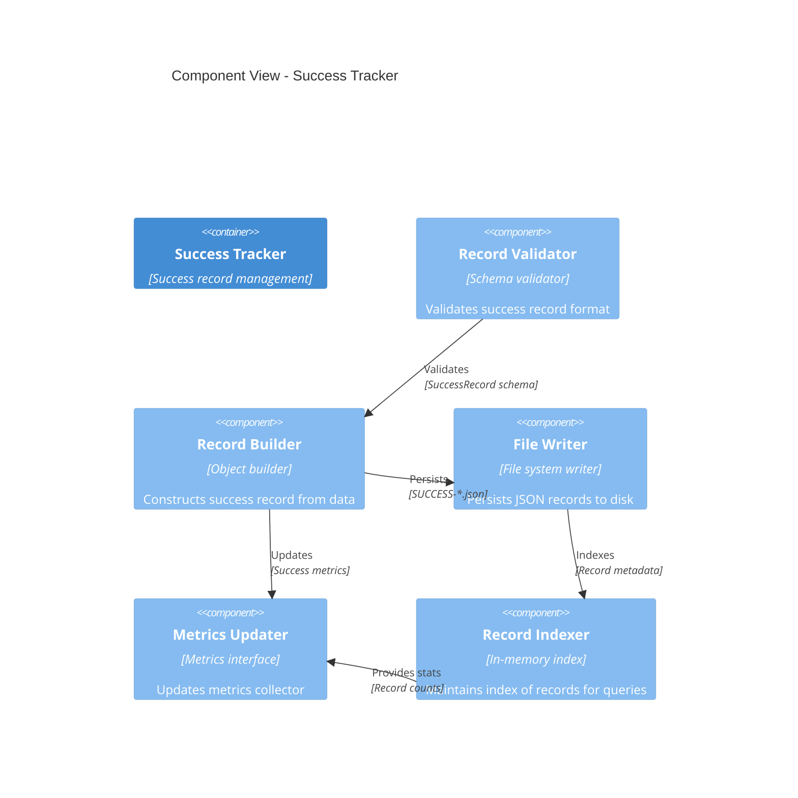

### C4 Level 3: Component View - Error Tracker

```mermaid
C4Component
  title Component View - Error Tracker

  Container(error_tracker, "Error Tracker", "Error record management")

  Component(error_classifier, "Error Classifier", "Categorization engine", "Categorizes errors by type")
  Component(error_context, "Error Context Builder", "Context extractor", "Extracts operation context")
  Component(error_formatter, "Error Formatter", "Structured formatter", "Formats error details")
  Component(error_writer, "Error Writer", "File system writer", "Persists JSON records to disk")
  Component(error_aggregator, "Error Aggregator", "Statistics engine", "Aggregates error statistics")
  Component(recovery_logger, "Recovery Logger", "Recovery tracker", "Logs recovery attempts")

  Rel(error_classifier, error_context, "Classifies", "Error category")
  Rel(error_context, error_formatter, "Provides context", "Operation details")
  Rel(error_formatter, error_writer, "Persists", "ERROR-*.json")
  Rel(error_formatter, error_aggregator, "Aggregates", "Error statistics")
  Rel(error_classifier, recovery_logger, "Tracks", "Recovery attempts")
  Rel(error_aggregator, metrics_updater, "Updates", "Error metrics")
```

### C4 Level 3: Component View - Metrics Collector

```mermaid
C4Component
  title Component View - Metrics Collector

  Container(metrics_collector, "Metrics Collector", "Metrics aggregation")

  Component(counter_aggregator, "Counter Aggregator", "Sum counter", "Accumulates count metrics")
  Component(gauge_sampler, "Gauge Sampler", "Value sampler", "Samples gauge metrics")
  Component(histogram_collector, "Histogram Collector", "Distribution collector", "Collects histogram data")
  Component(rate_calculator, "Rate Calculator", "Rate engine", "Calculates rates (per second)")
  Component(percentile_calculator, "Percentile Calculator", "Percentile engine", "Calculates P50, P90, P95, P99")
  Component(snapshot_generator, "Snapshot Generator", "Snapshot engine", "Generates periodic snapshots")
  Component(alert_checker, "Alert Checker", "Threshold monitor", "Monitors metrics against thresholds")

  Rel(counter_aggregator, snapshot_generator, "Provides", "Counter totals")
  Rel(gauge_sampler, snapshot_generator, "Provides", "Gauge values")
  Rel(histogram_collector, percentile_calculator, "Provides", "Distribution data")
  Rel(rate_calculator, snapshot_generator, "Provides", "Rate metrics")
  Rel(percentile_calculator, snapshot_generator, "Provides", "Percentile values")
  Rel(snapshot_generator, alert_checker, "Monitors", "Metric thresholds")
  Rel(alert_checker, metrics_updater, "Triggers", "Alert notifications")
```

---

## Sequence Diagrams

### Success Tracking Flow

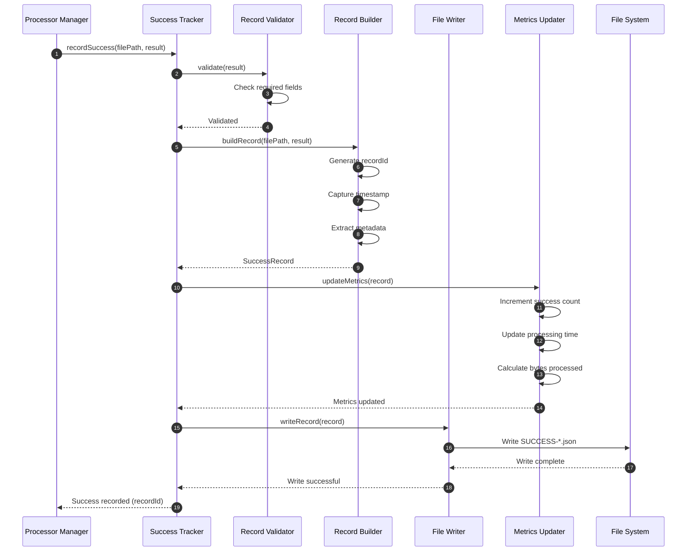

### Error Tracking Flow

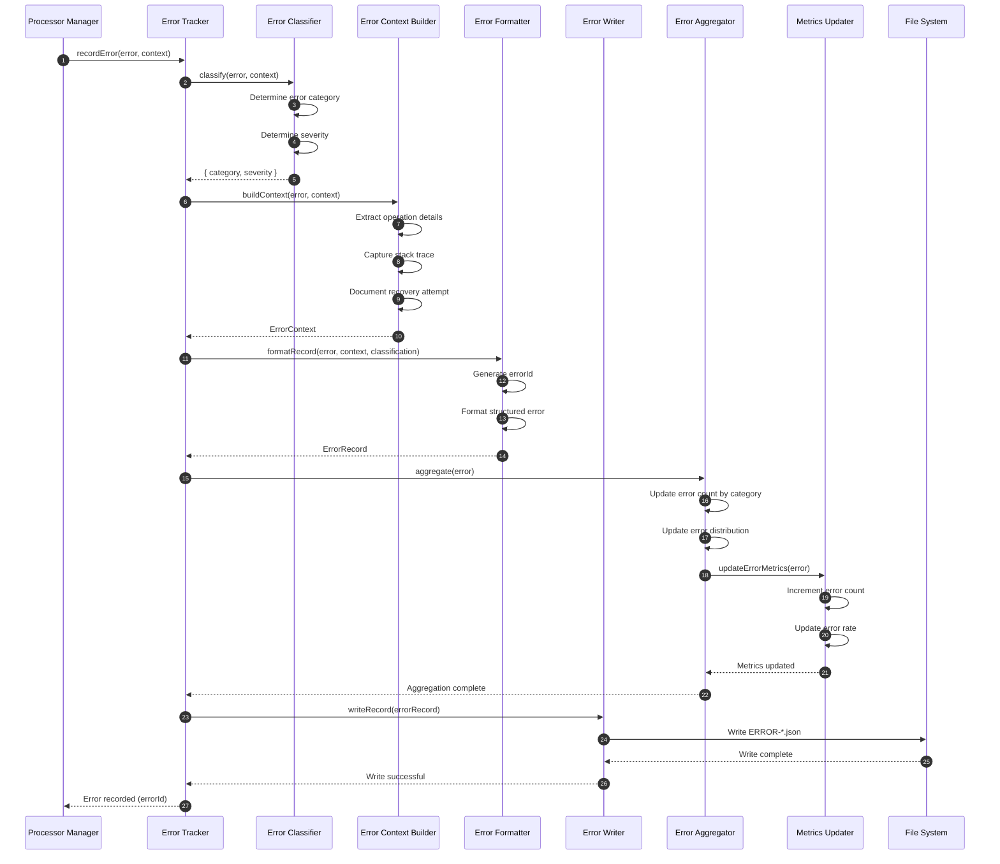

### Metrics Collection Flow

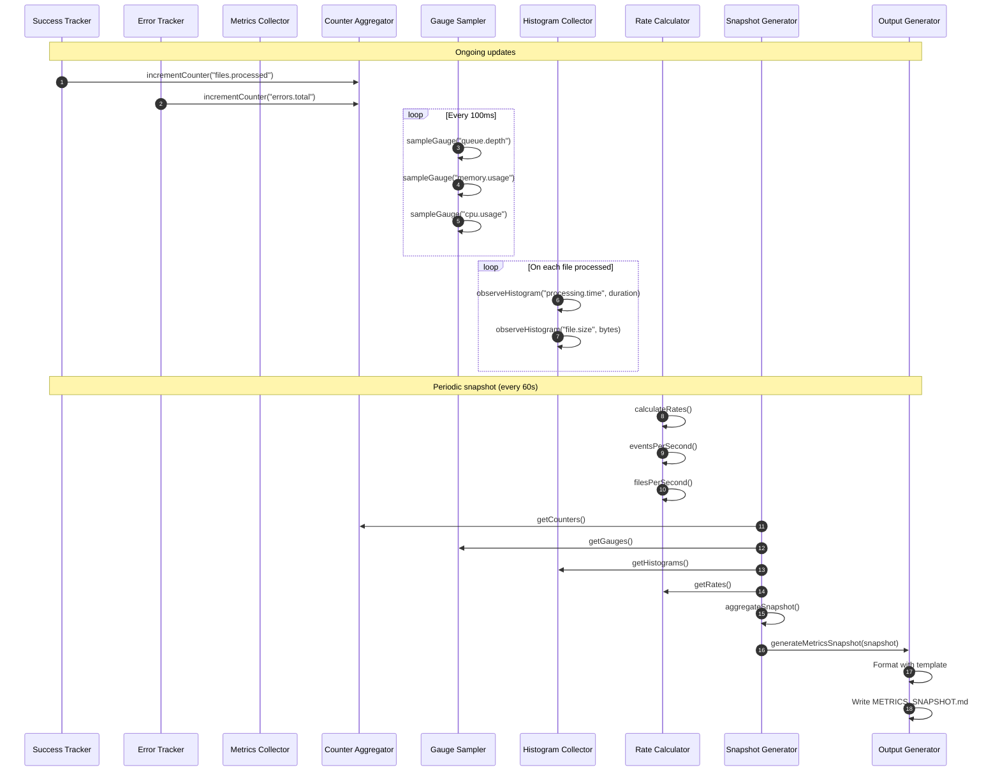

---

## State Diagrams

### Success Tracker State Machine

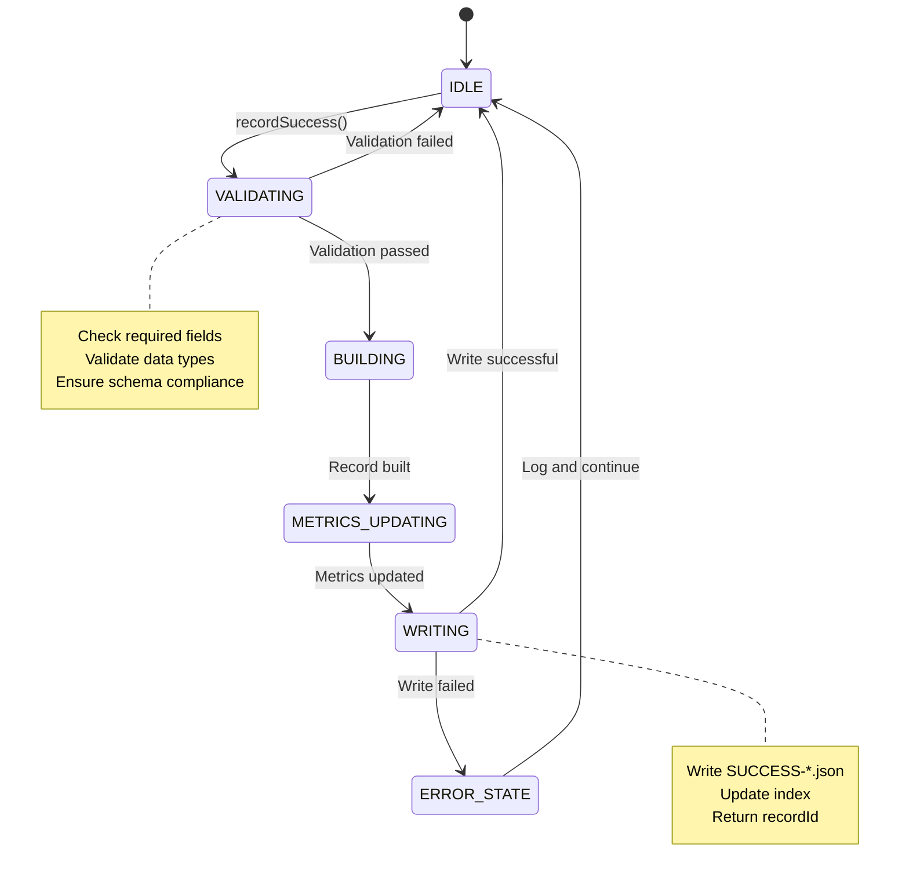

### Error Tracker State Machine

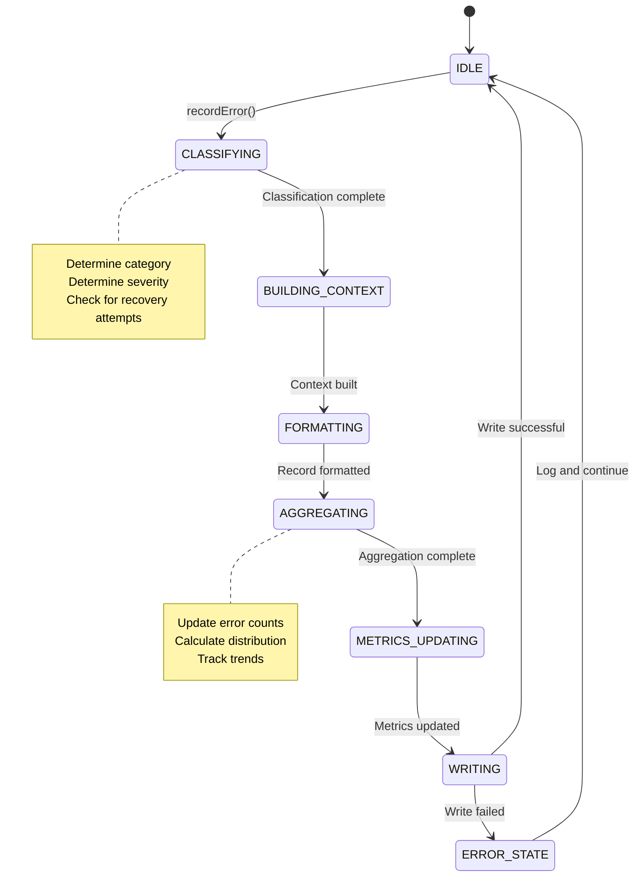

### Metrics Collector State Machine

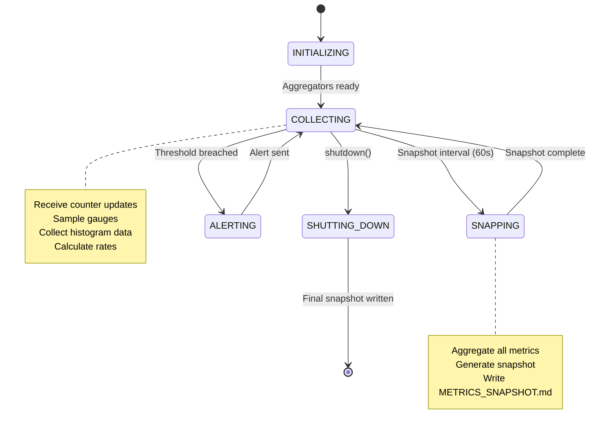

---

## Data Flow Diagrams

### Success Tracking Data Flow

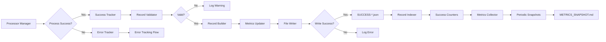

### Error Tracking Data Flow

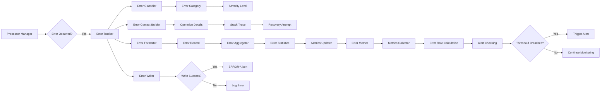

---

## Core Components

### 1. Watcher Service

**Responsibilities:**
- Monitor multiple directories using `fs.watch()`
- Emit file drop events
- Debounce events to handle incomplete writes
- Track watcher lifecycle

**Interface:**
```javascript
class WatcherService {
  constructor(tracker);
  start(directories: string[]): Promise<void>;
  stop(): Promise<void>;
  addDirectory(path: string): Promise<void>;
  removeDirectory(path: string): Promise<void>;
  getWatchedDirectories(): string[];
  getStatus(): WatcherStatus;
}

interface WatcherStatus {
  directories: number;
  eventsReceived: number;
  eventsProcessed: number;
  uptime: number;
}
```

**Event Tracking:**
- Events received (raw `fs.watch()` events)
- Events processed (after debouncing)
- Errors per directory
- Uptime per directory

---

### 2. Dispatcher Engine

**Responsibilities:**
- Route file events to appropriate processors
- Apply pattern filtering
- Queue processing for rapid file drops
- Manage concurrency

**Interface:**
```javascript
class DispatcherEngine {
  constructor(patternEngine, tracker);
  dispatch(fileEvent: FileEvent): Promise<void>;
  setConcurrency(limit: number): void;
  getQueueStatus(): QueueStatus;
}

interface FileEvent {
  filePath: string;
  watchDir: string;
  eventType: 'create' | 'modify' | 'delete';
  timestamp: Date;
}

interface QueueStatus {
  pending: number;
  processing: number;
  completed: number;
  failed: number;
}
```

**Tracking:**
- Files dispatched
- Files matched (by patterns)
- Files rejected (by patterns)
- Queue depth

---

### 3. Processor Manager

**Responsibilities:**
- Execute file processing pipeline
- Coordinate Context Builder and Output Generator
- Handle errors and retries
- Report success/failure

**Interface:**
```javascript
class ProcessorManager {
  constructor(contextBuilder, outputGenerator, tracker);
  process(filePath: string, context: Context): Promise<ProcessResult>;
  getProcessingStats(): ProcessingStats;
}

interface ProcessResult {
  success: boolean;
  outputPath?: string;
  error?: Error;
  duration: number;
  bytesProcessed: number;
}

interface ProcessingStats {
  totalProcessed: number;
  successful: number;
  failed: number;
  avgDuration: number;
  totalBytesProcessed: number;
}
```

**Tracking:**
- Files processed
- Success/failure counts
- Processing duration (min/max/avg)
- Bytes processed

---

## Tracking System

### Success Tracking

**What We Track:**
- Successfully processed files
- Output files created
- Context build results
- Pattern matching results

**Success Record Format:**

```json
{
  "recordId": "SUCCESS-2026-02-18-042345-001",
  "timestamp": "2026-02-18T04:23:45.123Z",
  "filePath": "/path/to/incoming/test.txt",
  "watchDir": "/path/to/incoming",
  "outputPath": "/path/to/incoming/test.obs.md",
  "context": {
    "matchedPatterns": ["*.txt"],
    "filesCollected": 1,
    "grepMatches": 0
  },
  "processing": {
    "duration": 45,
    "bytesProcessed": 1024,
    "fileType": "text"
  },
  "metadata": {
    "fileSize": 1024,
    "encoding": "utf-8"
  }
}
```

**Success Metrics:**
- Success rate (successful / total)
- Average processing time
- Files per minute
- Output generation rate

### Error Tracking

**What We Track:**
- Failed operations
- Error types and categories
- Component-level errors
- External tool failures

**Error Record Format:**

```json
{
  "errorId": "ERR-2026-02-18-042345-001",
  "timestamp": "2026-02-18T04:23:45.123Z",
  "severity": "ERROR",
  "category": "FileAccessError",
  "component": "Context Builder",
  "filePath": "/path/to/incoming/test.txt",
  "operation": "grepDirectory",
  "error": {
    "name": "PermissionDeniedError",
    "message": "EACCES: permission denied, read '/path/to/incoming'",
    "code": "EACCES",
    "stack": "Error: EACCES: permission denied\n    at ..."
  },
  "context": {
    "grepPattern": "TODO|FIXME",
    "directory": "/path/to/incoming",
    "filesAttempted": 5
  },
  "recovery": {
    "attempted": true,
    "fallback": "grep",
    "successful": false
  }
}
```

**Error Categories:**

| Category | Subcategories | Severity |
|----------|---------------|----------|
| **Configuration** | Invalid TOML, Missing config, Bad patterns | WARNING |
| **FileAccess** | Permission denied, File not found, Directory missing | ERROR |
| **PatternMatching** | Invalid pattern, Pattern too complex | WARNING |
| **ExternalTool** | Tool not found, Tool failed, Timeout | WARNING |
| **FileContent** | Binary file, Encoding error, Corrupt file | INFO |
| **System** | Out of memory, Disk full, Process crash | ERROR |

**Error Metrics:**
- Error rate (errors / total operations)
- Error distribution by category
- Error frequency over time
- Failed directories/files

---

## Metrics Collector

### Metrics Overview

The Metrics Collector aggregates tracking data from all components and provides summary reports and dashboards.

**Collected Metrics:**

| Metric | Type | Unit | Description |
|--------|------|------|-------------|
| **Files Watched** | Counter | files | Total files in watched directories |
| **Files Processed** | Counter | files | Total files processed |
| **Success Rate** | Gauge | % | (successful / total) * 100 |
| **Error Rate** | Gauge | % | (errors / total) * 100 |
| **Processing Time** | Histogram | ms | Duration of file processing |
| **Queue Depth** | Gauge | files | Current queue size |
| **Events/Second** | Gauge | events/s | File event frequency |
| **Uptime** | Gauge | seconds | Runner uptime |

### Metrics Output

**Console Output (Real-Time):**

```
================================================================================
Open Buckets Runner - Status
================================================================================

Uptime: 00:15:32 (932 seconds)
Watched Directories: 3

Event Statistics:
  Events Received:   1,234
  Events Processed: 1,200
  Event Rate:        1.29 events/s

Processing Statistics:
  Files Processed:     1,150
  Successful:          1,120 (97.4%)
  Failed:                30 (2.6%)
  Average Duration:     45ms
  Bytes Processed:   1.2 MB

Queue Status:
  Pending:         5 files
  Processing:      2 files
  Completed:    1,143 files

Error Summary:
  FileAccessError:       15 (50.0%)
  PatternError:           8 (26.7%)
  ExternalToolError:      5 (16.7%)
  ConfigurationError:     2 (6.7%)

Recent Errors (Last 5):
  1. ERR-2026-02-18-042345-001: Permission denied - /path/to/file.txt
  2. ERR-2026-02-18-042344-002: Invalid pattern - [*(bad
  3. ERR-2026-02-18-042343-003: ripgrep not found - /path/to/dir
  ...

================================================================================
Press 's' for status, 'e' for errors, 'q' to quit
================================================================================
```

**Log File (Periodic):**

```json
{
  "timestamp": "2026-02-18T04:30:00.000Z",
  "period": "5 minutes",
  "statistics": {
    "uptime": 300,
    "eventsReceived": 387,
    "eventsProcessed": 380,
    "filesProcessed": 356,
    "successful": 345,
    "failed": 11,
    "successRate": 96.9,
    "avgProcessingTime": 42,
    "bytesProcessed": 450560
  },
  "errors": {
    "total": 11,
    "byCategory": {
      "FileAccessError": 6,
      "PatternError": 3,
      "ExternalToolError": 2
    }
  }
}
```

---

---

## Error Recovery Strategies

### Error Recovery State Machine

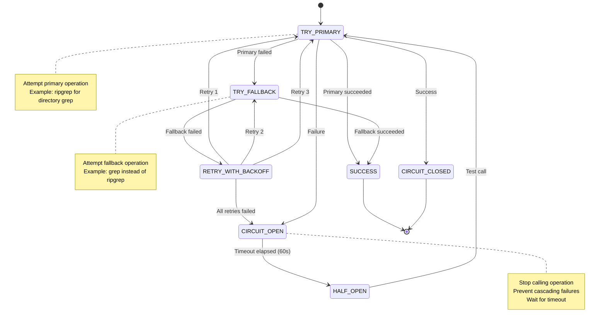

### Error Recovery Flow

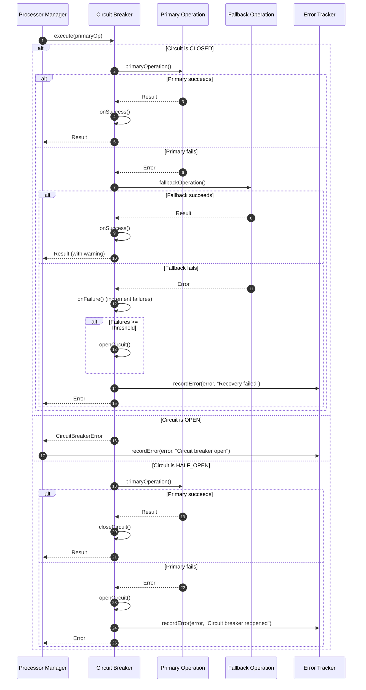

### Error Recovery Decision Tree

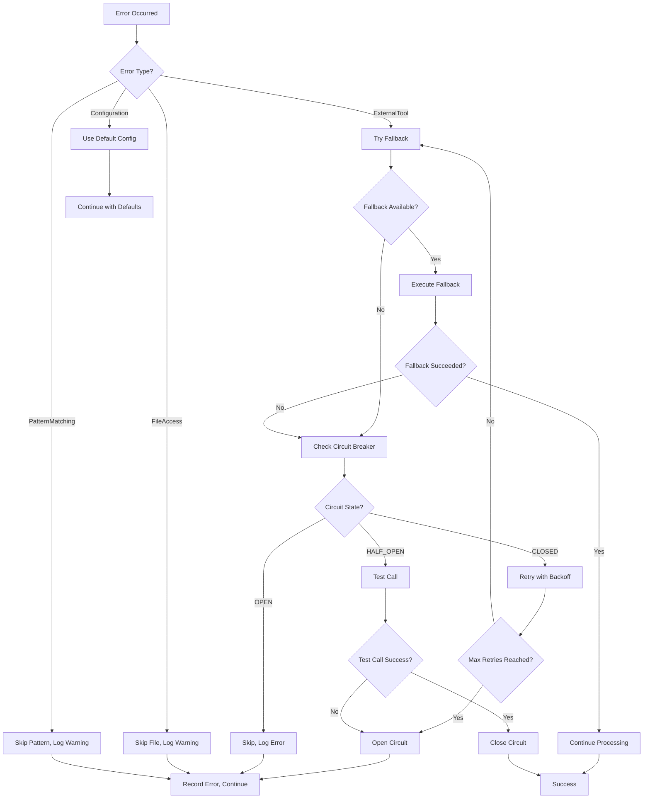

---

## Metrics Output Visualization

### Console Output Layout

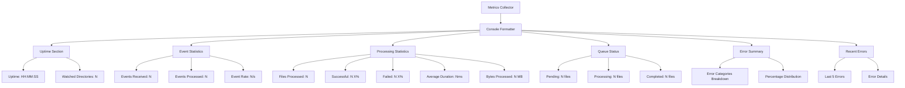

### Log File Structure

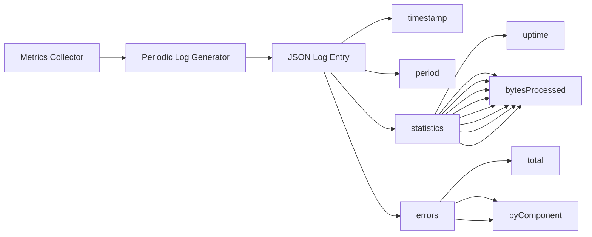

---

## Placeholder System Architecture

### Placeholder Generation Flow

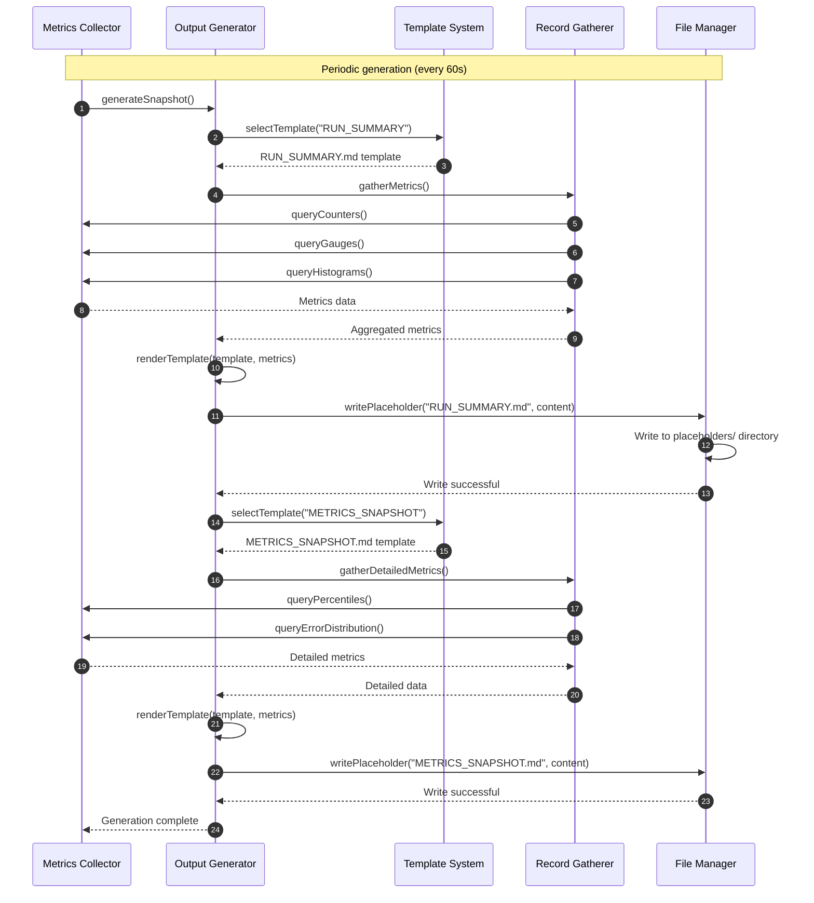

### Placeholder Template Hierarchy

```mermaid
flowchart TD
  A[Template System] --> B[Base Template]

  B --> C[Run Summary Template]
  B --> D[Metrics Snapshot Template]
  B --> E[Context Tree Template]
  B --> F[Config Dump Template]

  C --> C1[Frontmatter]
  C --> C2[Run Information]
  C --> C3[Event Statistics]
  C --> C4[Processing Statistics]
  C --> C5[Queue Status]
  C --> C6[Success Breakdown]
  C --> C7[Error Summary]
  C --> C8[Performance Metrics]

  D --> D1[Frontmatter]
  D --> D2[Snapshot Information]
  D --> D3[Counters]
  D --> D4[Gauges]
  D --> D5[Histograms]
  D --> D6[Performance Percentiles]
  D --> D7[Error Analysis]
  D --> D8[Alerts]
  D --> D9[Capacity Planning]

  E --> E1[Frontmatter]
  E --> E2[Directory Metadata]
  E --> E3[Directory Structure]
  E --> E4[File Statistics]
  E --> E5[File List]
  E --> E6[Context Relationships]
  E --> E7[Tags]

  F --> F1[Frontmatter]
  F --> F2[Global Configuration]
  F --> F3[Watched Directories]
  F --> F4[Active Patterns]
  F --> F5[Directory Grep Rules]
  F --> F6[File-Type Skills]
  F --> F7[Configuration Hierarchy]
  F --> F8[Configuration Validation]
  F --> F9[Configuration Export]

  style C fill:#e1f5ff
  style D fill:#e1f5ff
  style E fill:#e1f5ff
  style F fill:#e1f5ff
```

---

## Error Recovery Strategies (Original)

### 1. Graceful Degradation

**Strategy:** Continue processing when possible, log errors

**Implementation:**
```javascript
async function processWithFallback(filePath, context) {
  try {
    // Attempt primary operation
    return await primaryOperation(filePath, context);
  } catch (error) {
    logger.warn('Primary operation failed, trying fallback', error);
    try {
      // Attempt fallback
      return await fallbackOperation(filePath, context);
    } catch (fallbackError) {
      logger.error('Fallback also failed', fallbackError);
      errorTracker.trackError(fallbackError, context);
      throw fallbackError;
    }
  }
}
```

**Examples:**
- ripgrep not found → fallback to `grep`
- Config parse error → use default config
- Permission denied → skip file, log error

### 2. Retry with Backoff

**Strategy:** Retry transient errors with exponential backoff

**Implementation:**
```javascript
async function retryWithBackoff(operation, maxRetries = 3) {
  for (let attempt = 1; attempt <= maxRetries; attempt++) {
    try {
      return await operation();
    } catch (error) {
      if (attempt === maxRetries) {
        throw error;
      }
      const backoff = Math.pow(2, attempt) * 1000; // 1s, 2s, 4s
      logger.warn(`Attempt ${attempt} failed, retrying in ${backoff}ms`, error);
      await delay(backoff);
    }
  }
}
```

**Use Cases:**
- Network timeouts (future)
- Temporary file locks
- External tool failures

### 3. Circuit Breaker

**Strategy:** Stop calling failing operations after repeated failures

**Implementation:**
```javascript
class CircuitBreaker {
  constructor(threshold = 5, timeout = 60000) {
    this.threshold = threshold;
    this.timeout = timeout;
    this.failures = 0;
    this.state = 'closed'; // closed, open, half-open
    this.lastFailureTime = null;
  }

  async execute(operation) {
    if (this.state === 'open') {
      if (Date.now() - this.lastFailureTime > this.timeout) {
        this.state = 'half-open';
      } else {
        throw new Error('Circuit breaker is open');
      }
    }

    try {
      const result = await operation();
      this.onSuccess();
      return result;
    } catch (error) {
      this.onFailure();
      throw error;
    }
  }

  onSuccess() {
    this.failures = 0;
    this.state = 'closed';
  }

  onFailure() {
    this.failures++;
    this.lastFailureTime = Date.now();
    if (this.failures >= this.threshold) {
      this.state = 'open';
    }
  }
}
```

**Use Cases:**
- Repeated directory access failures
- External tool consistently failing
- Configuration file corrupted

---

## Placeholder for Implicit Elements

### 1. Context Building Placeholders

**Implicit Elements to Document:**

| Element | Placeholder | Description |
|---------|-------------|-------------|
| **Directory Tree** | `CONTEXT_TREE.md` | Hierarchical view of collected files |
| **File Relationships** | `RELATIONSHIPS.md` | Links between related files |
| **Content Summary** | `SUMMARY.md` | Brief description of collected context |
| **Tag Cloud** | `TAGS.md` | Auto-generated tags from content |

**Example Placeholder Structure:**

```markdown
---
type: context-placeholder
status: pending
generated_at: 2026-02-18T04:23:45.123Z
---

# Context Tree

## Directory Structure

```
/path/to/incoming/
├── test.txt
├── config.json
└── src/
    └── index.js
```

## File Counters

- Total files: 3
- Text files: 2
- Binary files: 1
- Grep matches: 5

## Tags

[[#todo]] [[#api]] [[#config]]

<!-- This file is auto-generated by Open Buckets -->
```

### 2. Run Log Placeholders

**Implicit Elements to Document:**

| Element | Placeholder | Description |
|---------|-------------|-------------|
| **Run Summary** | `RUN_SUMMARY.md` | Overview of current run |
| **Metrics Snapshot** | `METRICS.md` | Current metrics snapshot |
| **Active Patterns** | `PATTERNS.md` | Currently active patterns |
| **Configuration Dump** | `CONFIG_DUMP.md` | Full configuration dump |

**Example Placeholder Structure:**

```markdown
---
type: run-placeholder
run_id: "RUN-2026-02-18-042345"
status: active
---

# Run Summary

**Run ID:** RUN-2026-02-18-042345
**Started At:** 2026-02-18T04:23:45.123Z
**Uptime:** 00:05:32

## Watched Directories

1. `/path/to/incoming` (23 files)
2. `/path/to/processed` (12 files)
3. `/path/to/uploads` (5 files)

## Statistics

- Events Received: 1,234
- Files Processed: 1,150
- Success Rate: 97.4%
- Error Rate: 2.6%

<!-- This file is auto-generated by Open Buckets -->
```

---

## Usage Examples

### Example 1: Basic Runner with Tracking

```javascript
const { Runner, Tracker } = require('open-buckets');

// Initialize tracker
const tracker = new Tracker({
  logFile: './open-buckets.log',
  errorDir: './errors',
  metricsInterval: 60000 // 1 minute
});

// Initialize runner
const runner = new Runner({
  directories: ['./incoming', './processed'],
  concurrency: 5,
  tracker
});

// Start runner
await runner.start();

// Monitor status
setInterval(() => {
  const status = runner.getStatus();
  console.log(status);
}, 5000);
```

### Example 2: Querying Error Records

```javascript
const { Tracker } = require('open-buckets');

const tracker = new Tracker();

// Get recent errors
const recentErrors = await tracker.getErrors({
  since: new Date(Date.now() - 3600000), // Last hour
  limit: 10
});

console.log('Recent Errors:');
recentErrors.forEach(error => {
  console.log(`- [${error.severity}] ${error.error.message}`);
  console.log(`  File: ${error.filePath}`);
  console.log(`  Component: ${error.component}`);
});

// Get error statistics
const stats = await tracker.getErrorStats();
console.log('Error Distribution:');
stats.byCategory.forEach((count, category) => {
  console.log(`  ${category}: ${count}`);
});
```

### Example 3: Generating Success Report

```javascript
const { Tracker } = require('open-buckets');

const tracker = new Tracker();

// Generate success report
const report = await tracker.generateSuccessReport({
  since: new Date(Date.now() - 86400000), // Last 24 hours
  groupBy: 'directory'
});

console.log('Success Report (Last 24h):');
report.byDirectory.forEach((stats, dir) => {
  console.log(`\n${dir}:`);
  console.log(`  Processed: ${stats.total}`);
  console.log(`  Successful: ${stats.successful} (${stats.successRate}%)`);
  console.log(`  Avg Duration: ${stats.avgDuration}ms`);
  console.log(`  Bytes: ${formatBytes(stats.totalBytes)}`);
});
```

---

## Next Steps

### Implementation Tasks

1. **Implement Tracker Class**
   - [ ] Error tracking methods
   - [ ] Success tracking methods
   - [ ] Metrics collection
   - [ ] Report generation

2. **Implement Processor Manager**
   - [ ] Process file pipeline
   - [ ] Concurrency management
   - [ ] Error handling
   - [ ] Retry logic

3. **Implement Metrics Collector**
   - [ ] Counter/Gauge/Histogram
   - [ ] Aggregation
   - [ ] Console output
   - [ ] Log file output

4. **Create Placeholder Templates**
   - [ ] Context tree template
   - [ ] Run summary template
   - [ ] Metrics snapshot template
   - [ ] Configuration dump template

5. **Add CLI Commands**
   - [ ] `--status` command
   - [ ] `--errors` command
   - [ ] `--report` command
   - [ ] `--metrics` command

### Testing

- [ ] Unit tests for Tracker
- [ ] Unit tests for Processor Manager
- [ ] Integration tests for Runner
- [ ] Performance benchmarks
- [ ] Error injection tests

---

**References:**
- [ADR-001: Architecture Overview](./adr/001-architecture-overview.md)
- [arc42-05: Runtime View](./arc42-05-runtime-view.md)
- [PRD-001: Product Requirements](./prd/001-product-requirements.md)
